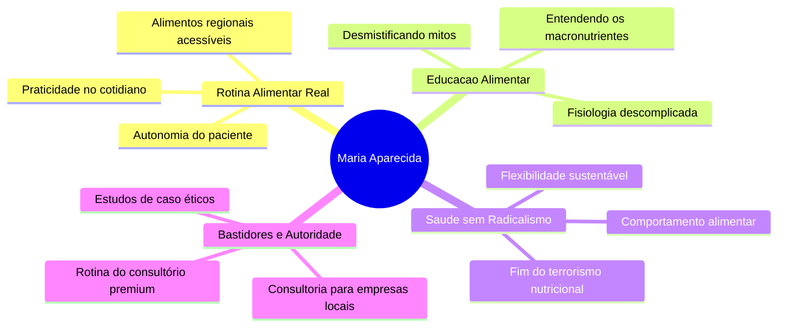

# FLUXAI OS™ • ONBOARDING ESTRATÉGICO & GOVERNANÇA OPERACIONAL
## CLIENTE: MARIA APARECIDA DA SILVA • NUTRICIONISTA & CONSULTORA ALIMENTAR

---

## 1. PERFIL CORPORATIVO E GERAL (CRM)

### 📋 Informações Gerais
* **Nome Completo:** Maria Aparecida da Silva
* **Marca Institucional:** Maria Aparecida • Nutricionista & Consultora Alimentar
* **Segmentação Comercial:** Nutrição Clínica de Alta Performance + Consultoria Alimentar Corporativa
* **Abrangência Geográfica:** Porto de Pedras e Região (Alagoas) • Atendimento Local Híbrido + Consultório Digital
* **Registro Profissional de Referência:** Conselho Regional de Nutrição (CRN-AL)
* **Status Cadastral:** Onboarding Estratégico Concluído • Operação Iniciada

### 💳 Dados Financeiros
* **Status Contratual:** Assinado & Registrado
* **Mensalidade Recorrente:** R$ 800,00 (Assinatura básica mensal)
* **Forma de Liquidação:** PIX Direto
* **Data de Vencimento:** Todo dia 05 de cada mês
* **Status Financeiro:** Ativo & Adimplente
* **Centro de Custo:** FluxAI Governança Geral

### ⚙️ Governança Operacional
* **Líder de Operação (FluxAI):** Brenda (Arquiteta Operacional)
* **Entregas Contratadas:** 2 Posts Carrossel Estratégicos + 2 Reels de Autoridade por mês
* **Escopo Geográfico de Captação:** Porto de Pedras e Região
* **Ambiente de Trabalho Digital:** Google Workspace + Canva Teams + FluxAI OS™
* **Frequência de Atualização de Métricas:** Mensal (Fechamento no último dia útil)

---

## 2. ESTRUTURA DE ATIVOS E INFRAESTRUTURA DIGITAL

### 🔗 Links Rápidos Operacionais
* **Pasta de Contrato & Operação:** [Google Drive - Operação](https://drive.google.com/drive/folders/14stjSxP6piUM2w0gFmRS-v9H2zjFIE0P?usp=drive_link)
* **Diretório de Identidade Visual:** [Google Drive - Brand Identity](https://drive.google.com/drive/folders/1K__Y4QTCfJ_4cnr54iocJyhFEDsPa5iZ?usp=drive_link)
* **Instagram Oficial:** [@mariaaparecida.nutri](https://www.instagram.com/mariaaparecida.nutri)
* **Canal de Comunicação Direta:** [WhatsApp Direct (+55 82 99305-1282)](https://wa.me/5582993051282)

---

## 3. DNA DA MARCA E POSICIONAMENTO ESTRATÉGICO

Maria Aparecida **NÃO é uma influencer fitness genérica**. Ela é uma **autoridade técnica de saúde, orientadora humanizada e consultora alimentar corporativa**. Seu posicionamento deve transmitir o valor de uma medicina alimentar sofisticada, mas ancorada no cotidiano real das pessoas.

### 🎯 Objetivos de Posicionamento (30 a 90 dias)
1. **Fortalecer a Autoridade Regional:** Consolidar a marca Maria Aparecida como a maior referência de nutrição clínica e consultoria em Porto de Pedras e Região.
2. **Atrair Pacientes Qualificados (Premium):** Filtrar o público atraindo pacientes dispostos a investir em saúde continuada e preventora, em vez de tratamentos de emagrecimento rápido e estético.
3. **Parcerias Corporativas:** Construir pontes de autoridade para atrair contratos de consultoria com hotéis, pousadas premium da Rota Ecológica e empresas locais que demandam adequação de cardápios e nutrição para colaboradores.
4. **Construção de Confiança:** Usar a comunicação digital como extensão da empatia demonstrada no consultório.

### 🗣️ Identidade Verbal (Diretrizes de Tom de Voz)

| DEVE Transmitir | NÃO DEVE Transmitir |
| :--- | :--- |
| **Autoridade Técnica:** Dados, ciência, fisiologia explicada de forma clara e profissional. | **Sensacionalismo:** Títulos apelativos, promessas de transformação em X dias. |
| **Rotina Alimentar Real:** Leveza, praticidade, alimentos regionais e acessíveis. | **Terrorismo Nutricional:** Classificar alimentos comuns como "venenos" ou "proibidos". |
| **Acolhimento Humano:** Empatia pelas dificuldades da rotina de mães, profissionais e trabalhadores. | **Estética Fitness Genérica:** Foco em abdômen trincado, suplementação excessiva, padrões irreais. |
| **Sofisticação e Leveza:** Estética clean, comunicação silenciosa, refinamento executivo. | **Linguagem de Influencer:** Gírias passageiras, excesso de dancinhas, posturas apelativas. |

---

## 4. PILARES EDITORIAIS E ESTRATÉGIA DE CONTEÚDO

Os pilares refletem a fusão entre a nutrição baseada em evidências científicas e a consultoria alimentar prática:



* **Pilar 1: Rotina Alimentar Real e Prática**
  * *Conceito:* Como se alimentar bem morando na região, utilizando ingredientes locais frescos (frutas tropicais, peixes, raízes). Desmistificar a ideia de que comer saudável exige ingredientes importados caros.
* **Pilar 2: Educação Alimentar Científica (Fisiologia Descomplicada)**
  * *Conceito:* Explicar como o corpo funciona, os benefícios reais da hidratação, como melhorar a digestão e a energia diária através da alimentação consciente.
* **Pilar 3: Saúde Sustentável sem Radicalismo**
  * *Conceito:* Combater dietas restritivas extremas. Defender a constância, o prazer em comer e a valorização da saúde mental associada à mesa.
* **Pilar 4: Bastidores Profissionais e Consultoria**
  * *Conceito:* Mostrar a rotina de estudos, a preparação de materiais de apoio para pacientes, e insights sobre como a consultoria alimentar ajuda negócios gastronômicos locais a crescerem com segurança sanitária e valor nutricional.

---

## 5. GOVERNANÇA ÉTICA (DIRETRIZES DO CONSELHO FEDERAL DE NUTRIÇÃO - CFN)

> [!IMPORTANT]
> A comunicação da cliente no ambiente digital deve seguir estritamente as resoluções vigentes do Conselho Federal de Nutrição (Resolução CFN nº 599/2018 - Código de Ética e de Conduta do Nutricionista, e Resolução CFN nº 702/2021).

### 🚫 Bloqueios e Restrições de Publicidade Nutricional (CFN)

1. **Antes e Depois Proibido:** É expressamente vedado ao nutricionista divulgar imagens corporais de pacientes (comparações visuais de emagrecimento ou ganho de massa), mesmo com autorização expressa do paciente.
2. **Promessas de Resultados:** Não fazer promessas de resultados rápidos, perda de peso garantida ou transformações milagrosas. A perda de peso e saúde dependem de fatores multifatoriais.
3. **Sensacionalismo e Pânico:** Proibido utilizar termos alarmistas que gerem pânico alimentar (ex: "o glúten está te inflamando", "açúcar é veneno mortal").
4. **Associação Indevida com Suplementos/Marcas:** O nutricionista não pode divulgar marcas de suplementos, produtos alimentícios específicos, laboratórios ou marcas comerciais que configurem conflito de interesses de publicidade dirigida.
5. **Divulgação de Valores e Ofertas:** É vedado divulgar preços de consultas ou fazer promoções do tipo "feche 3 consultas e ganhe 1" ou sorteio de atendimentos de forma pública.

---

## 6. ROADMAP OPERACIONAL DE 30 DIAS

```
[Semana 1] ──► [Semana 2] ──► [Semana 3] ──► [Semana 4]
Alinhamento    Primeiras      Expansão       Análise de
e CFN Guard    Aprovações     Regional &     Métricas &
Editoriais     de Pautas      Empresas       Ajustes LTV
```

### 🗓️ Semana 01: Setup Estratégico, Pilares e Compliance
* **Ações Operacionais:**
  1. Criação e sincronização do ecossistema de pastas operacionais no Google Drive.
  2. Alinhamento da identidade visual da marca baseada no material recebido.
  3. Mapeamento da Bio do Instagram para posicionamento de alto nível.
  4. Varredura ética (compliance) da comunicação existente à luz do CFN.
* **Entregável Principal:** Planejamento dos pilares editoriais específicos para o mês 01 e estruturação da linguagem de comunicação de Porto de Pedras.

### 🗓️ Semana 02: Pautas, Criação e Percepção Premium
* **Ações Operacionais:**
  1. Redação do primeiro roteiro de Reels e design do primeiro Carrossel Educativo.
  2. Revisão gramatical e adequação de tom de voz (científico mas acolhedor).
  3. Envio na esteira do Content Engine para aprovação da cliente.
  4. Otimização de botões de contato na Bio (Linktree/WhatsApp oficial).
* **Entregável Principal:** Primeiro lote de conteúdos aprovados na esteira e prontos para captação local/postagem.

### 🗓️ Semana 03: Conteúdo de Tração e Atração Comercial
* **Ações Operacionais:**
  1. Criação do primeiro carrossel sobre "Consultoria Alimentar para Hotéis e Pousadas".
  2. Publicação de posts abordando a alimentação do dia a dia regional de forma técnica e prática.
  3. Integração de chamadas para ação humanizadas ("Dúvidas sobre como organizar seus macronutrientes? Deixe nos comentários").
* **Entregável Principal:** Post de posicionamento corporativo focado em empresas gastronômicas e hoteleiras locais.

### 🗓️ Semana 04: Métricas do Instagram e Ajustes de Esteira
* **Ações Operacionais:**
  1. Extração manual de dados de engajamento, alcance e novos seguidores do Instagram.
  2. Registro formal das métricas mensais na aba correspondente do FluxAI OS™.
  3. Análise qualitativa dos comentários dos posts (quais dores foram levantadas?).
  4. Reunião curta ou relatório de performance alinhando o planejamento do ciclo 02.
* **Entregável Principal:** Relatório de Fechamento Mensal de Métricas e pautas ajustadas para o próximo ciclo de crescimento.
