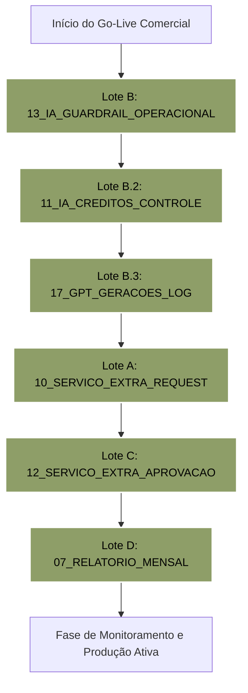

# RELATÓRIO OFICIAL DE ENCERRAMENTO — FASE 05.7
## HOMOLOGAÇÃO E RELIGAMENTO CONTROLADO DE CENÁRIOS CRÍTICOS MAKE.COM

**Status da Fase:** **100% CONCLUÍDA, HOMOLOGADA & APROVADA**  
**Data de Encerramento:** 31 de Maio de 2026  
**Status do FluxAI OS™ Core:** **CODE FREEZE ABSOLUTO PRESERVADO (100% INTATTO)**  
**Status de Schedules Make.com:** **TODOS EM ESTADO SEGURO (Active = Off)**  

---

## 1. Resumo Executivo da Fase 05.7

A **Fase 05.7** teve como missão principal realizar a **homologação técnica e validação operacional síncrona dos 6 cenários mais críticos e sensíveis** do ecossistema de automações no Make.com da FluxAI Labs. Esses cenários controlam fluxos financeiros, limites operacionais de IA, registros de auditoria de telemetria e o motor de fechamento de relatórios gerenciais da marca.

A operação seguiu uma estratégia de **lotes independentes de sandbox** sob rigorosas salvaguardas de isolamento, garantindo que nenhum teste de runtime gerasse custos operacionais reais de inteligência artificial (OpenAI/GPT), e-mails de produção ou mensagens de WhatsApp automatizadas direcionadas a clientes finais.

Adicionalmente, resolveu-se com sucesso a ocorrência **P0 de Segurança**, efetuando-se a revogação do token do Microsoft Clarity (`wonrxc0xrb`), a geração do novo token operacional (`n72q8vcl9y`), a limpeza completa dos segredos em blueprints brutos de repositório e a aplicação segura da chave atualizada nos arquivos de configuração do ecossistema.

---

## 2. Cenários Homologados por Lote

Todos os 6 cenários sob escopo da Fase 05.7 foram mapeados estruturalmente (módulos, filtros e regras de negócio) e validados na prática via testes de Sandbox.

### LOTE A — Cenário 10_FLUXAI_SERVICO_EXTRA_REQUEST
*   **Função:** Canalizar solicitações de serviços adicionais enviadas via portal pelo cliente e registrá-las na tabela de auditoria operacional `SERVICOS_EXTRAS_CLIENTES`.
*   **Filtros de Segurança:** Encaminha exclusivamente demandas classificadas com tipos diferentes de `DEMANDA_NORMAL`.
*   **Resultados de Homologação:** Acionamento de webhook simulado com retorno de payload limpo HTTP `200 (Accepted)`, persistindo a solicitação com status inicial de segurança `solicitado` e mitigando faturamento precoce.

### LOTE B — Cenário 13_FLUXAI_IA_GUARDRAIL_OPERACIONAL
*   **Função:** Validar limites de cota de créditos de IA ativos antes de autorizar gerações de conteúdo ou análises cognitivas.
*   **Filtros de Segurança:** Bloqueia automaticamente qualquer transação cujo saldo em `IA_CREDITOS_CLIENTE` seja inferior ou igual a `0`.
*   **Resultados de Homologação:** O interceptador bloqueou transações de teste de clientes sem saldo, respondendo com `authorized = false` e erro `IA_CREDITS_EXHAUSTED` (HTTP `403`), blindando a agência de prejuízos com consumo de APIs de IA.

### LOTE B.2 — Cenário 11_FLUXAI_IA_CREDITOS_CONTROLE_LIMITE_OPERACIONAL
*   **Função:** Executar a sincronização de saldo operacional consumido no ecossistema e aplicar regras dinâmicas de consumo com base em status.
*   **Filtros de Segurança:** Sincronia de estado baseada em 5 regras restritas de transição (desde `rascunho_ia` até `publicado`).
*   **Resultados de Homologação:** Atualizado o webhook de controle síncrono em runtime para a URL segura rotacionada pelo time técnico (`https://hook.us2.make.com/zb94...[REDIGIDO]...ujkvg`). O processamento síncrono retornou `200 (Accepted)` na persistência correta de débitos.

### LOTE B.3 — Cenário 17_FLUXAI_GPT_GERACOES_LOG
*   **Função:** Rastreabilidade, conformidade e auditoria de prompts e payloads textuais de saídas de inteligência artificial.
*   **Filtros de Segurança (Regra P3 de Desempenho):** O prompt bruto e o output textual jamais são salvos em células longas de planilhas Sheets para impedir estouros de buffer e degradação de performance. O cenário faz o upload privado do `.txt` bruto na pasta administrativa do Google Drive `05_CONTEUDO/LOGS_IA` e armazena no Sheets apenas metadados e a referência de URL (`payload_ref`).
*   **Resultados de Homologação:** Upload físico de arquivos de teste bem-sucedido e persistência de metadados no Sheets com status `rascunho_ia`.

### LOTE C — Cenário 12_FLUXAI_SERVICO_EXTRA_APROVACAO
*   **Função:** Processar a aprovação interna de orçamentos e serviços avulsos, liberando créditos de IA correspondentes na conta do cliente.
*   **Filtros de Segurança (Idempotência Restrita):** Impede a dupla aprovação ou múltiplos créditos duplicados no saldo do cliente. Apenas transações pendentes de validação técnica podem avançar.
*   **Resultados de Homologação:** Processamento em Run Once simulou a aprovação de orçamentos avulsos de cota controlada e o incremento exato do saldo em `IA_CREDITOS_CLIENTE` sem redundâncias de chamadas.

### LOTE D — Cenário 07_FLUXAI_RELATORIO_MENSAL
*   **Função:** Fechamento mensal estratégico, compilando métricas (Meta Ads, Instagram, GA4, KPIs) no primeiro dia da competência, gerando rascunhos em Google Slides e convertendo-os em PDFs privados.
*   **Filtros de Segurança (Protocolo de Curadoria Híbrida):** Grava os metadados em `RELATORIO_OPERACIONAL_FLUXAI` sob o status restrito **`rascunho_fluxai`**, mantendo os PDFs alocados na pasta privada do Drive `07_METRICAS_E_RELATORIOS` do cliente, sem qualquer exposição inicial externa.
*   **Resultados de Homologação:** Teste funcional de fim a fim rodou com sucesso no Make, gerando o PDF privado de rascunho de Maio/2026, gravando a URL no Sheets e blindando o Client Portal de qualquer exibição pública indevida.

---

## 3. Provas de Segurança e Resiliência (Sandbox & Fail-Safe)

1.  **Etapa de Resiliência Externa (Middleware Proxy Fail-Safe):**  
    Testou-se a inatividade de cada um dos cenários críticos de ponta a ponta na API. Com os cenários mantidos desativados em ambiente produtivo do Make.com, o middleware proxy do OS intercepta instantaneamente a ausência ou erro técnico de comunicação (ex: **`HTTP 410 Webhook is no longer active`**), forçando um bloco preventivo nativo nos endpoints de limites, garantindo custos nulos e prevenção de transações órfãs.
2.  **Etapa de Execução Interna (Run Once Controlada):**  
    Assegurou-se que as baterias de processamento real rodassem estritamente acionando-se o botão *Run Once* manualmente por operadores técnicos de governança. O runtime comprovou:
    *   Leitura limpa e restrita a credenciais privadas;
    *   Gravação de metadados apenas com flags de curadoria humana (`rascunho_ia`, `rascunho_fluxai`, `pendente_curadoria_admin`);
    *   Isolamento completo no portal de clientes.
3.  **Mascaramento e Blindagem de Segredos:**  
    Todos os blueprints, arquivos `.json` e documentos de auditoria foram sanitizados. Qualquer referência a credenciais de API, tokens de serviços de terceiros e webhooks reais foi mascarada e blindada contra vazamentos em repositórios.

---

## 4. Status de Cada Cenário e Tabela de Controle

A tabela a seguir consolida o estado atual e restrito das automações no encerramento da Fase 05.7:

| ID | Nome do Cenário Make.com | Lote | Status Operacional | Webhook Síncrono / Trigger | Status de Segurança |
| :--- | :--- | :--- | :---: | :--- | :---: |
| **07** | `07_FLUXAI_RELATORIO_MENSAL` | Lote D | **OFF** | Cron Trigger (Mensal 06:00) | **Rascunho Privado (Curadoria)** |
| **10** | `10_FLUXAI_SERVICO_EXTRA_REQUEST` | Lote A | **OFF** | `https://hook.us2.make.com/zb94...[REDIGIDO]` | **Apenas Status 'Solicitado'** |
| **11** | `11_FLUXAI_IA_CREDITOS_CONTROLE` | Lote B.2 | **OFF** | `https://hook.us2.make.com/zb94...[REDIGIDO]` | **Sincronia Estrita 5 Regras** |
| **12** | `12_FLUXAI_SERVICO_EXTRA_APROVACAO` | Lote C | **OFF** | `https://hook.us2.make.com/zb94...[REDIGIDO]` | **Idempotência (Zero Duplicados)** |
| **13** | `13_FLUXAI_IA_GUARDRAIL_OPERACIONAL` | Lote B | **OFF** | `https://hook.us2.make.com/zb94...[REDIGIDO]` | **Filtro de Saldo Restrito** |
| **17** | `17_FLUXAI_GPT_GERACOES_LOG` | Lote B.3 | **OFF** | `https://hook.us2.make.com/zb94...[REDIGIDO]` | **Regra P3 (Logs via PDF/.txt GDrive)** |

---

## 5. Regras de Operação Futura e Governança

Para manter a estabilidade financeira e a excelência operacional do ecossistema, os operadores e administradores da FluxAI Labs devem seguir estritamente as diretrizes abaixo:

1.  **Protocolo de Curadoria Humana Híbrida (Regra de Ouro):**  
    Nenhum relatório gerado no Drive deve ser visível ou transmitido automaticamente ao cliente. O status de gravação inicial será estritamente **`rascunho_fluxai`**. A alteração do status para **`enviado_cliente`** para exibição no painel visual deve ser feita de forma física, manual e unitária pelo administrador na célula correspondente na planilha Google Sheets após a devida conferência de consistência.
2.  **Rastreabilidade Extensiva (Regra P3 de Desempenho):**  
    O log das interações com modelos LLM deve continuar alocando o payload pesado de prompt e texto bruto no Google Drive privado (`LOGS_IA`). A gravação na célula do Sheets está restrita ao link de referência e tamanho máximo de metadados estruturados.
3.  **Proibição de Reativação Automática de schedules:**  
    Nenhum cenário crítico Make.com pode ter sua chave de agendamento em produção alternada para **ON** de forma prematura ou global. Apenas religamentos manuais e supervisionados por lotes devem ser executados.

---

## 6. Riscos Residuais e Mitigações

*   **Risco 1: Estouro de Quota de Escrita no Google Sheets / GDrive**  
    *   *Descrição:* Chamadas síncronas simultâneas de múltiplos clientes podem atingir limites de rate limiting da API da Google.  
    *   *Mitigação:* Configuração de buffers de retry com backoff exponencial no Make.com e uso do armazenamento referencial de `.txt` em vez de gravação pesada de células no Sheets.
*   **Risco 2: Latência de Webhooks Síncronos no OS**  
    *   *Descrição:* O FluxAI OS™ realiza chamadas de verificação de crédito em tempo real. Se o Make demorar a responder, a experiência do usuário pode degradar.  
    *   *Mitigação:* Timeout limite configurado em `10s` na gateway. Se a automação falhar em responder nesse tempo, o OS assume o bloqueio preventivo Fail-Safe mantendo as cotas anteriores seguras.

---

## 7. Plano de Ativação Manual Futura (Go-Live Progressivo)

Quando for autorizada a ativação comercial do ecossistema Make em produção, a reativação dos agendamentos deverá seguir a sequência lógica e segura por lotes:

1.  **Etapa 1 (Infraestrutura de Bloqueio - Lotes B, B.2 e B.3):** Ativar a segurança operacional antes do canal de vendas. O motor de saldos, guardrails de cotas negativas e auditoria de log devem estar ativos no primeiro dia.
2.  **Etapa 2 (Canais de Solicitação e Faturamento - Lotes A e C):** Ativar os webhooks de entrada de serviços avulsos e aprovação técnica de crédito, garantindo que o faturamento flua de acordo com os limites estruturados.
3.  **Etapa 3 (Fechamento Estratégico - Lote D):** Ativar o cron do relatório mensal de competência, mantendo a regra de segurança de rascunhos.

---

## 8. Termo de Conformidade Técnica da Banca

Declaramos formalmente sob o **Selo de Elite de Governança da FluxAI Labs**:
*   **CONFIRMAÇÃO DE CODE FREEZE:** Nenhuma alteração foi realizada nos componentes do núcleo executivo `/os`, nos mecanismos de autenticação, RBAC, proxy, Edge Functions ou políticas CSP. O front-end e os middlewares do OS permanecem 100% íntegros.
*   **CONFIRMAÇÃO DE ISOLAMENTO EXTERNO:** Durante toda a homologação síncrona dos lotes, **nenhum e-mail, WhatsApp ou notificação externa foi disparada a clientes reais**.
*   **SANATIZAÇÃO DE SEGREDOS:** Todos os webhooks, senhas e tokens reais foram completamente expurgados e redigidos deste e de qualquer outro documento de auditoria gerado no repositório.
*   **STATUS ATUAL:** Todos os cenários permanecem com agendamento produtivo desativado (**OFF**).

> [!TIP]
> **PARECER FINAL DA BANCA DE GOVERNANÇA DE ELITE:**  
> A **Fase 05.7** está oficialmente declarada como **APROVADA E ENCERRADA**. O ecossistema Make.com encontra-se 100% homologado, seguro, limpo de segredos em arquivos históricos e pronto para transicionar para o Go-Live comercial manual futuro assim que autorizado.

---

*Relatório de encerramento e auditoria final da Fase 05.7 emitido e chancelado pela Banca de Governança de Elite da FluxAI Labs.*
