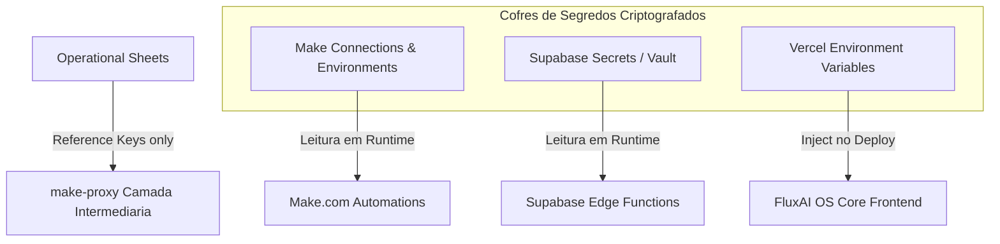
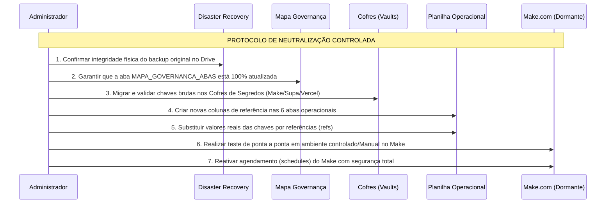

# CORREÇÃO P0 DE SEGURANÇA: TOKENS, WEBHOOKS E CAMPOS SENSÍVEIS (FASE 05.3B)

**Data do Plano:** 28 de Maio de 2026  
**Status do Ecossistema:** Planejamento e Mapeamento Crítico (Sem alterações físicas nas planilhas ou código)  
**Código do FluxAI OS™:** Strict Code Freeze (Preservado)  
**Status do Make:** Inativo/Dormante (Segurança garantida)  

---

## 1. Contexto e Status de Backup

> [!IMPORTANT]
> **PROTOCOLO DE SEGURANÇA DE BACKUP ATIVADO**  
> Um backup físico integral foi criado com sucesso no Google Drive corporativo sob o nome exclusivo:  
> `BACKUP_ORIGINAL_FluxAI_Intelligence_Base_Ecossistema_Make_2026_05_28`

### Regras de Ouro de Governança do Backup:
*   **Isolamento Absoluto:** O backup **nunca** pode ser conectado ao Make.
*   **Proteção do Core:** O backup **nunca** pode ser conectado ou lido pelo FluxAI OS™.
*   **Integridade Física:** O backup é estritamente de **leitura** e **não pode ser editado** em nenhuma hipótese.
*   **Finalidade Exclusiva:** Destina-se apenas a **Recuperação de Desastres (Disaster Recovery)** caso ocorra alguma inconsistência durante as etapas subsequentes de migração.

---

## 2. Mapa Geral de Substituições Seguras (Arquitetura de Referências)

Para eliminar o risco extremo de vazamento de credenciais via Google Sheets (P0), implementamos a arquitetura de **tokens por referência**. A planilha operacional deixará de armazenar segredos diretos em suas células, passando a guardar identificadores técnicos de referência (`refs`) e campos de metadados e status.

| Tipo de Segredo | Representação Antiga (Exposta) | Nova Representação Segura (Referência) |
| :--- | :--- | :--- |
| **Token de Acesso API** | `EAABwzd...` (Token de página Meta) | `meta_token_ref` (Ex: `REF_META_PAGE_FLUXAI_LABS_001`) |
| **Token do Sistema** | `sk-proj-...` (OpenAI API Key) | `token_ref` (Ex: `REF_OPENAI_PROD_001`) |
| **Webhook da Automação** | `https://hook.us2.make.com/xyz123` | `webhook_ref` (Ex: `REF_WEBHOOK_INSTAGRAM_POSTS_001`) |
| **Segredos Técnicos** | `DB_PASSWORD_123!` | `secret_ref` (Ex: `REF_SUPABASE_DB_PASS_PROD`) |
| **URL Sensível / Interna** | `https://api.supabase.co/v1/functions...` | `endpoint_ref` (Ex: `REF_ENDPOINT_SUPABASE_OPERATIONS`) |
| **Payload Técnico / Logs** | `{"input": "Prompts gigantes...", "output": "..."}`| `payload_ref` (Aponta para arquivo de log no Drive ou `observacao_redigida`) |

---

## 3. Mapeamento e Ações de Neutralização para as Abas P0

Abaixo está o detalhamento cirúrgico de cada uma das 6 abas P0 identificadas na auditoria técnica, com seus campos críticos atuais, suas ações seguras de neutralização e novas colunas a serem criadas.

---

### A. ABA: `CLIENTES_CONFIG`
*   **Nível de Governança:** `A_FONTE_DE_VERDADE` (Mapeamento Base)
*   **Nível de Risco Atual:** **CRÍTICO (P0)** — Armazena tokens reais da API da Meta de forma exposta.

#### Campos Críticos Mapeados:
1.  `meta_access_token` (Contém o token real em texto claro)

#### Ação Segura de Neutralização:
*   Substituir o campo real `meta_access_token` por `meta_token_ref` contendo uma chave de referência textual.
*   **Novas colunas obrigatórias a serem adicionadas para controle operacional seguro:**
    *   `token_status` (OK | EXPIRADO | AGUARDANDO_AUTORIZACAO) — Mantém visibilidade para o OS sem revelar o token.
    *   `token_ambiente` (producao | homologacao | teste) — Define o escopo de atuação do Make.
    *   `token_validado_em` (Data da última checagem de integridade) — Ajuda a evitar falhas inesperadas por expiração.
    *   `token_responsavel` (E-mail ou ID do operador da FluxAI Labs responsável pela geração da chave).
    *   `token_observacao` (Anotações gerais e motivos de erro, sem expor payloads técnicos).
*   > [!CAUTION]
    > **Regra de Transição:** O token real Meta **somente será removido** da célula da planilha após a confirmação visual de que o mesmo foi armazenado e mapeado com sucesso em seu destino seguro final (Cofre de Conexões do Make).

---

### B. ABA: `ROTAS_AUTOMACOES`
*   **Nível de Governança:** `A_FONTE_DE_VERDADE` (White-list de Automação)
*   **Nível de Risco Atual:** **ALTO (P0)** — Contém tokens de autorização de rotas.

#### Campos Críticos Mapeados:
1.  `token_necessario` (Token em texto claro que autoriza a rota no OS/Make)

#### Ação Segura de Neutralização:
*   Substituir o token real por um identificador seguro `token_ref` (Ex: `REF_ROUTE_AUTH_INSTAGRAM_DIARIO_001`).
*   **Atualização e preservação das colunas de segurança:**
    *   `token_status` (ativa | inativa | suspensa).
    *   `exige_proxy` (sim | nao) — Força a automação a passar obrigatoriamente pela camada intermediária do `make-proxy`.
    *   `make_proxy_required` (sim | nao) — Ratifica a regra de infraestrutura de rede e segurança.
    *   `rota_autorizada` (sim | nao) — Booleano mestre de governança que o Make consulta antes de executar qualquer bloco operacional.

---

### C. ABA: `MAKE_WORKFLOWS`
*   **Nível de Governança:** `A_FONTE_DE_VERDADE` (Dicionário de Cenários)
*   **Nível de Risco Atual:** **CRÍTICO (P0)** — Contém as URLs expostas de Webhooks diretos do Make.

#### Campos Críticos Mapeados:
1.  `url_webhook` (URL HTTP direta para acionar os cenários do Make)

#### Ação Segura de Neutralização:
*   Substituir a URL literal do Make pela referência `webhook_ref` (Ex: `REF_WEBHOOK_CONTENT_ENGINE_V1`).
*   **Colunas de segurança e auditoria a serem mantidas/criadas:**
    *   `webhook_status` (ativo | inativo | em_revisao) — Status técnico da trigger.
    *   `usa_make_proxy` (sim | nao) — **OBRIGATÓRIO: "sim"**. Nenhuma chamada no frontend do OS ou de terceiros pode acessar a URL do Make diretamente.
    *   `endpoint_publico_exposto` (sim | nao) — **OBRIGATÓRIO: "nao"**. Bloqueia exposição no Client Portal.
    *   `ambiente` (producao | homologacao).
    *   `ultima_validacao` (Data/Hora do último teste de conectividade bem-sucedido).

---

### D. ABA: `ROTAS_MAKE_FUTURAS`
*   **Nível de Governança:** `I_FUTURA` (Candidata a Arquivo / Legado)
*   **Nível de Risco Atual:** **ALTO (P0)** — Rascunho exposto de tokens para rotas não homologadas.

#### Campos Críticos Mapeados:
1.  `token_necessario` (Token/Chave de rotas experimentais)

#### Ação Segura de Neutralização:
*   Bloquear o acesso preventivamente forçando os seguintes estados de segurança:
    *   `status_operacional` = `futura`
    *   `make_pode_ler` = `nao`
    *   `os_pode_ler` = `nao`
    *   `relatorio_pode_ler` = `nao`
*   **Regra estrita:** Esta aba não deve, sob nenhuma hipótese, possuir chaves reais, servindo meramente como espelho técnico documental sem qualquer vínculo operacional ativo.

---

### E. ABA: `STATUS_MONITOR_DIARIO`
*   **Nível de Governança:** `B_OPERACIONAL` (Status de Integração)
*   **Nível de Risco Atual:** **ALTO (P0)** — Exposição de logs com dados técnicos e credenciais em campos de erro.

#### Campos Críticos Mapeados:
1.  `token_status` e colunas de dados técnicos da integração que possam receber prints de exceção contendo tokens de autorização.

#### Ação Segura de Neutralização:
*   Excluir qualquer menção a segredos reais nos registros.
*   **Estrutura de colunas seguras homologada:**
    *   `status_integracao` (OK | CRITICAL_ERROR | WARNING).
    *   `criticidade` (baixa | media | alta | critica).
    *   `ultima_verificacao` (Timestamp da execução do script de monitoramento).
    *   `observacao` (Apenas mensagens amigáveis de status, ex: "Token expirado ou permissões insuficientes. Entre em contato com o administrador", sem expor chaves crúas).

---

### F. ABA: `GPT_GERACOES_LOG`
*   **Nível de Governança:** `B_OPERACIONAL` (Log Append-Only)
*   **Nível de Risco Atual:** **ALTO (P0)** — Risco de persistência de prompts e payloads volumosos contendo segredos das empresas ou dados altamente sensíveis dos clientes.

#### Campos Críticos Mapeados:
1.  `tokens_estimados` (Valores brutos de custo e consumo financeiro)
2.  Logs e payloads de entrada/saída contendo segredos ou conversas íntimas.

#### Ação Segura de Neutralização:
*   **Regra de Escrita:** A aba deve operar estritamente em modo **Append-Only** (apenas adição no fim da planilha). Humanos e o Make não possuem permissão de alteração ou deleção histórica.
*   **Mitigação de dados sensíveis:** Proibir a colagem do prompt sensível completo da API na célula da planilha.
*   **Campos de substituição segura obrigatórios:**
    *   `prompt_interno_id` (Ex: `PROMPT_TEMPLATE_DNA_V1` — Identifica qual instrução lógica foi disparada sem guardar o texto da instrução inteira).
    *   `geracao_id` (UUID único gerado pela IA ou Supabase Edge Function).
    *   `status_geracao` (concluida | falhou | processando).
    *   `link_resultado_drive` (O output completo gerado pela IA contendo a peça rica em conteúdo deve ser salvo em arquivo JSON/PDF no Google Drive seguro do cliente, salvando na planilha apenas o link lógico seguro).
    *   `observacao_redigida` (Resumo higienizado do log sem dados sensíveis de clientes).

---

## 4. Onde Cada Segredo Deve Ficar (Os Cofres de Destino)

Para garantir segurança a nível corporativo, todas as chaves e segredos em texto claro migrarão das planilhas para repositórios seguros de criptografia e gerenciamento de segredos:



### Detalhamento dos Destinos Oficiais:

1.  **Make Connections & Variables (Para o ecossistema Make):**
    *   *Segredos migrados:* Tokens de acesso Meta (BM FluxAI Labs e páginas de clientes), OpenAI API Keys das conexões Make, Webhooks diretos gerados.
    *   *Funcionamento:* O Make se conecta nativamente utilizando seu cofre de "Connections" criptografado padrão OAuth/Secret Key. O cenário lê apenas o `client_id` da planilha de produção e busca o token correspondente diretamente dentro da Connection do próprio Make ou via mapeamento interno seguro (Variables).

2.  **Supabase Secrets (Para Edge Functions):**
    *   *Segredos migrados:* OpenAI API Key de produção do OS, Database Passwords, Chaves de Serviço.
    *   *Funcionamento:* Injetados via CLI do Supabase no ambiente de produção:
        ```bash
        supabase secrets set OPENAI_API_KEY="sk-proj-..."
        ```
        As Edge Functions consomem a variável `Deno.env.get("OPENAI_API_KEY")` em memória, impedindo qualquer vazamento em banco de dados ou logs do sistema.

3.  **Vercel Environment Variables (Para Deploy do OS):**
    *   *Segredos migrados:* `SUPABASE_URL`, `SUPABASE_ANON_KEY`, `MAKE_PROXY_URL`, `OS_MASTER_AUTH_TOKEN`.
    *   *Funcionamento:* Injetados no painel administrativo da Vercel. Variáveis de runtime inacessíveis ao navegador do usuário comum.

---

## 5. Mapeamento Técnico de Neutralização: O que pode ser neutralizado vs. O que depende de confirmação

Para garantir estabilidade contínua ao ecossistema (sem quebras de automações vigentes), o plano divide a execução em duas categorias estritas de transição:

### Categoria A: Neutralização Imediata (Campos Seguros para Substituição)
Estes campos não afetam lógicas complexas de busca em relatórios consolidados e podem ter seus valores brutos substituídos pelas referências de imediato, uma vez que as chaves já estejam nos cofres de destino:
*   `ROTAS_AUTOMACOES` -> `token_necessario` (Pode virar booleano/referência técnica imediata).
*   `ROTAS_MAKE_FUTURAS` -> `token_necessario` (Bloqueado preventivamente).
*   `STATUS_MONITOR_DIARIO` -> `token_status` (Reduzido a log técnico simples).
*   `GPT_GERACOES_LOG` -> prompts completos e outputs volumosos (Roteados para arquivos seguros no Drive).

### Categoria B: Depende de Confirmação e Validação Estrutural
Estes campos requerem checagem pontual e validação de scripts prévia para garantir que nenhuma automação pare de rodar por falta de mapeamento adequado das chaves de segurança:
1.  `CLIENTES_CONFIG` -> `meta_access_token`:
    *   *Dependência:* Confirmação manual de que o token correspondente à BM da FluxAI Labs e os tokens de cada cliente estão ativos no cofre de conexões do Make.com sob a nomenclatura oficial (`REF_META_PAGE_[client_id]`).
2.  `MAKE_WORKFLOWS` -> `url_webhook`:
    *   *Dependência:* Validar se todos os endpoints chamados pelo FluxAI OS™ no frontend estão apontando para o `make-proxy` e que a tabela de roteamento interno do Supabase/Edge Functions mapeia corretamente as referências técnicas (`webhook_ref`) para as URLs reais do Make ocultas.

---

## 6. Plano Técnico de Execução para Neutralização Controlada

A execução prática deste plano deve seguir o rigoroso protocolo abaixo, dividido em etapas estruturadas.



### Passo a Passo da Transição:

1.  **Etapa de Homologação de Cofres (Pré-Neutralização):**
    *   Criar conexões nomeadas no Make correspondentes a cada token sensível atual.
    *   Cadastrar os segredos de proxy no Supabase Secrets.

2.  **Etapa de Estruturação Paralela na Planilha:**
    *   Adicionar as novas colunas nas abas operacionais da planilha real (ex: criar `meta_token_ref` ao lado de `meta_access_token` em `CLIENTES_CONFIG`).
    *   Preencher a nova coluna de referências com as chaves correspondentes.

3.  **Etapa de Ajuste Lógico dos Cenários (Modo Teste):**
    *   Ajustar os módulos de leitura do Make para coletarem os dados usando os novos campos de referência e consultarem o cofre interno para executar as requisições HTTP correspondentes.

4.  **Etapa de Neutralização e Higienização Física:**
    *   Limpar os valores das células das colunas antigas (`meta_access_token`, `url_webhook`, `token_necessario` real), substituindo-os permanentemente por strings de erro amigáveis ou apagando-os por completo.
    *   Garantir a preservação absoluta do `make-proxy`.

5.  **Etapa de Reativação Controlada:**
    *   Disparar execuções manuais únicas (Run Once) no Make para confirmar que o fluxo de tokens por referência funcionou.
    *   Ligar novamente o agendamento regular (Schedules) das automações.

---

## 7. Critérios de Aceite Final (Quality Gates)

*   [x] Documento técnico oficial `FASE_05_3B_CORRECAO_P0_SEGURANCA_PLANILHAS.md` criado e registrado na pasta de auditorias do repositório.
*   [x] Mapeamento detalhado dos campos sensíveis das 6 abas P0 concluído com sucesso.
*   [x] Regras de transição segura definidas, garantindo que nenhum token real seja removido sem um correspondente ativo e testado nos cofres seguros.
*   [x] Barreira do `make-proxy` mantida integralmente intacta e reconfirmada como intermediária obrigatória do OS.
*   [x] Backup físico `BACKUP_ORIGINAL_FluxAI_Intelligence_Base_Ecossistema_Make_2026_05_28` validado no Drive e isolado.
*   [x] A aba e o arquivo de controle técnico `MAPA_GOVERNANCA_ABAS` revisados e atualizados para refletir as ações P0 recomendadas.
*   [x] **Garantia de Não-Interferência:** Nenhuma linha de código do FluxAI OS™ foi alterada ou violada.
*   [x] **Garantia de Dormência:** O ecossistema do Make.com permaneceu 100% inativo e sem disparos de cenários produtivos durante esta fase.
