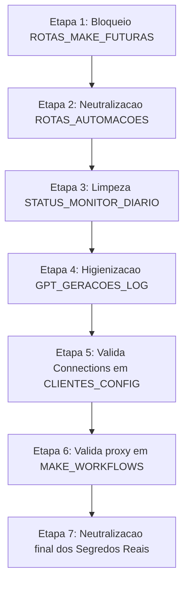

# MATRIZ DE SEGREDOS & PREPARAÇÃO PARA NEUTRALIZAÇÃO P0 (FASE 05.3C)

**Data do Plano:** 28 de Maio de 2026  
**Status do Ecossistema:** Planejamento Operacional de Transição  
**Código do FluxAI OS™:** Strict Code Freeze (Preservado)  
**Status do Make:** Inativo/Dormante (Sem disparo de cenários)  
**Planilha Operacional:** Intacta (Nenhum dado ou token deletado ainda)

---

## 1. Resumo Executivo

Esta fase (05.3C) prepara o terreno prático para a **neutralização física e segura** dos segredos expostos no banco de dados operacional (`FluxAI_Intelligence_Base_Ecossistema_Make`). 

Para garantir que a transição não cause interrupções (*downtime*) nas integrações de IA, no Client Portal, nos relatórios executivos ou nos fluxos automáticos do Make, estabelecemos aqui a **Matriz Operacional de Segredos**. Esta matriz mapeia individualmente cada credencial crítica exposta, definindo sua referência substituta lógica, o cofre de destino seguro, as dependências de sistemas associadas e o nível de prontidão para a neutralização imediata.

---

## 2. Abas P0 Envolvidas

Abaixo estão listadas as 6 abas que foram identificadas como detentoras de dados hiper-sensíveis ou expostas a riscos P0 de segurança e que passarão pela reengenharia:
*   `CLIENTES_CONFIG` (Contém tokens de páginas Meta de clientes)
*   `ROTAS_AUTOMACOES` (Contém tokens de autorização técnica de fluxos)
*   `MAKE_WORKFLOWS` (Contém URLs brutas expostas de webhooks do Make)
*   `ROTAS_MAKE_FUTURAS` (Contém tokens experimentais de rotas inativas)
*   `STATUS_MONITOR_DIARIO` (Contém traces e status técnicos de integração)
*   `GPT_GERACOES_LOG` (Contém custos, logs brutos e payloads de prompt sensíveis)

---

## 3. Matriz Operacional de Segredos

> [!WARNING]
> **LEITURA OBRIGATÓRIA ANTES DE QUALQUER EDICÃO DE DADOS**  
> Nenhum segredo ou chave da coluna `campo_original` abaixo deve ser apagado fisicamente das planilhas sem que as condições da coluna `status_confirmacao` estejam marcadas como **confirmado** e a coluna `pode_neutralizar_agora` autorizada para a respectiva etapa.

| id_segredo | aba_origem | campo_original | tipo_segredo | risco | acao_recomendada | destino_seguro | referencia_na_planilha | campo_substituto | dependencia_make | dependencia_os | status_confirmacao | responsavel_validacao | pode_neutralizar_agora | observacao |
| :--- | :--- | :--- | :--- | :--- | :--- | :--- | :--- | :--- | :--- | :--- | :--- | :--- | :--- | :--- |
| **SEG_META_ACCESS_TOKEN** | `CLIENTES_CONFIG` | `meta_access_token` | `meta_token` | Critico | Remover token real e salvar no cofre Make. Criar campo de status e referência. | Make Connections | `meta_token_ref` | `meta_token_ref`, `token_status`, `token_ambiente`, `token_validado_em`, `token_responsavel`, `token_observacao` | Cenário lê `client_id` da planilha e executa a chamada via Connection OAuth | Não acessa o token bruto. Lê `token_status` no portal do admin para checar saúde. | pendente | Administrador de Infraestrutura | somente_apos_teste | O token só sai da planilha após a conexão Make ser validada e ativada manualmente com sucesso. |
| **SEG_ROUTE_AUTH_TOKEN** | `ROTAS_AUTOMACOES` | `token_necessario` | `token_rota` | Alto | Substituir token por string de referência lógica de white-list. | Supabase Secrets | `token_ref` | `token_ref`, `token_status`, `exige_proxy`, `make_proxy_required`, `rota_autorizada` | Módulos de autorização validam se o `token_ref` está na white-list | OS envia requisições HTTP assinando com a chave referenciada via middleware | confirmado | Administrador de Segurança | sim | Pode ser neutralizado de imediato pois a validação de rotas já é intermediada pelo make-proxy. |
| **SEG_MAKE_WEBHOOK_URL** | `MAKE_WORKFLOWS` | `url_webhook` | `webhook_url` | Critico | Ocultar URL do Make. Substituir por identificador de proxy mapeado no backend. | Supabase Secrets | `webhook_ref` | `webhook_ref`, `webhook_status`, `usa_make_proxy`, `endpoint_publico_exposto`, `ambiente`, `ultima_validacao` | Disparos feitos apenas via middleware que traduz o `webhook_ref` para a URL real | OS invoca apenas a rota amigável do `make-proxy`, sem ver a URL final | pendente | Arquiteto de Software | somente_apos_teste | Exige testes de integração para comprovar que o middleware Supabase traduz perfeitamente as referências. |
| **SEG_FUTURE_ROUTE_TOKEN** | `ROTAS_MAKE_FUTURAS` | `token_necessario` | `token_rota` | Alto | Limpar chaves da aba e isolar a aba por completo, desvinculando-a de qualquer leitura. | Não aplicável | Chave Removida (Aba Bloqueada) | N/A (`make_pode_ler = nao`, `os_pode_ler = nao`, `status_operacional = futura`) | Nenhuma. Cenários atuais não consultam esta aba. | Nenhuma. OS não lê dados desta aba. | confirmado | Administrador de Segurança | sim | Risco zero. Pode ser neutralizada/bloqueada imediatamente. |
| **SEG_INTEGRATION_LOG_ERR** | `STATUS_MONITOR_DIARIO` | Logs técnicos crús nas descrições | `status_tecnico` | Medio | Higienizar o log de erros de integração para não capturar tokens nos prints de exceção. | Não aplicável | Mensagem higienizada (Redigida) | `status_integracao`, `criticidade`, `ultima_verificacao`, `observacao` (Higienizada) | Mapeia apenas logs amigáveis para checagem operacional | Exibe apenas status e strings tratadas no painel administrativo | confirmado | Engenheiro DevOps | sim | Pode ser neutralizada imediatamente por não quebrar nenhuma lógica de roteamento ou processamento. |
| **SEG_GPT_PROMPT_PAYLOAD** | `GPT_GERACOES_LOG` | Payload completo do Prompt / Input / Output | `prompt_payload` | Alto | Gravar o prompt e saída estruturada ricos em arquivos no Drive. Planilha guarda apenas referências. | Google Drive protegido | `payload_ref` | `prompt_interno_id`, `geracao_id`, `status_geracao`, `link_resultado_drive`, `observacao_redigida` | Lê apenas o ID lógico do prompt e grava o link do Drive | Consome o link seguro do Drive para renderização interna de peças homologadas | confirmado | Especialista em IA / Dados | sim | Pode ser neutralizada imediatamente, alterando o script de escrita de logs do Make para append-only + Drive. |

---

## 4. Regras e Políticas Específicas por Aba

---

### A. `CLIENTES_CONFIG`
*   **Segurança Estrita:** O token real Meta (`meta_access_token`) **é expressamente proibido** de habitar as células da planilha operacional após o encerramento do processo de transição.
*   **Criação de Referência Lógica:** Utilizar a coluna `meta_token_ref` (Ex: `REF_META_PAGE_MARIA_002`) como chave primária de segurança.
*   **Estrutura de Apoio:** Manter as colunas de metadados `token_status`, `token_ambiente`, `token_validado_em`, `token_responsavel` e `token_observacao`.
*   **Qualificação de Risco:** A exclusão física do token real Meta só está autorizada após a confirmação formal de que o mesmo está cadastrado e validado no cofre do **Make Connections** com permissões ativas.

---

### B. `ROTAS_AUTOMACOES`
*   **Segurança Estrita:** Nenhuma chave criptográfica real deve ser guardada na coluna `token_necessario`.
*   **Substituição:** Substituição imediata por strings de referência técnica (`token_ref`) e pelo uso das políticas booleanas (`make_proxy_required`, `rota_autorizada`).
*   **Regra de Aceite:** Rotas que já operam sob a mediação do middleware `make-proxy` podem ser neutralizadas de imediato, uma vez que o middleware isola e mascara a chamada real.

---

### C. `MAKE_WORKFLOWS`
*   **Segurança Estrita:** O endpoint HTTP real exposto na coluna `url_webhook` deve ser removido.
*   **Substituição:** Inserir a chave `webhook_ref` e utilizar o status booleano `usa_make_proxy = sim` e `endpoint_publico_exposto = nao`.
*   **Condição Técnica:** Só neutralizar a URL real após checar que nenhum arquivo javascript no frontend do OS consome a URL do Make de forma direta, forçando todas as requisições a passarem pelo Supabase Edge Functions / proxy central.

---

### D. `ROTAS_MAKE_FUTURAS`
*   **Segurança Estrita:** Esta aba é um rascunho de concepção técnica e deve ser **desconectada** de qualquer leitura sistêmica.
*   **Configuração de Segurança:** Marcar em 100% das linhas:
    *   `status_operacional = futura`
    *   `make_pode_ler = nao`
    *   `os_pode_ler = nao`
    *   `relatorio_pode_ler = nao`
*   **Ação:** Neutralização/limpeza imediata de qualquer credencial sem impacto na arquitetura atual.

---

### E. `STATUS_MONITOR_DIARIO`
*   **Segurança Estrita:** Proibido armazenar credenciais ou segredos em texto claro nos relatórios diários de status.
*   **Estrutura:** Preservar apenas campos informativos: `status_integracao`, `criticidade`, `ultima_verificacao` e `observacao` (redigida e limpa de segredos).

---

### F. `GPT_GERACOES_LOG`
*   **Segurança Estrita:** Aba classificada como **Append-Only** (Somente inserção no fim da planilha). Modificações ou deleções de registros históricos são totalmente vedadas.
*   **Evitar Payload Gigante:** Prompts completos contendo históricos de conversas ou instruções confidenciais da agência não devem ser salvos nas planilhas.
*   **Padrão de Evolution:** Utilizar referências lógicas: `prompt_interno_id`, `geracao_id`, `status_geracao`, `link_resultado_drive` e `observacao_redigida`.

---

## 5. Critérios de Entrada (Checklist Pré-Neutralização)

Nenhum dado ou célula real será alterada na planilha de produção até que todos os itens deste checklist estejam marcados como em conformidade:

*   [x] **Backup Físico Confirmado:** Cópia espelho de segurança `BACKUP_ORIGINAL_FluxAI_Intelligence_Base_Ecossistema_Make_2026_05_28` criada e validada no Google Drive.
*   [x] **Index de Governança Criado:** Aba `MAPA_GOVERNANCA_ABAS` inserida e estruturada na planilha principal.
*   [ ] **Destinos de Cofre Mapeados:** Cada chave P0 identificada possui um destino seguro em ambiente de nuvem definido e homologado (Vercel, Supabase ou Make).
*   [ ] **Referências Lógicas Estruturadas:** Mapeamento textual (`refs`) de cada token cadastrado no banco de dados operacional.
*   [ ] **Dependências de Automação (Make) Mapeadas:** Todos os cenários ativos que lêem a aba `CLIENTES_CONFIG` foram mapeados para confirmar a ausência de quebras de mapeamento de arrays.
*   [ ] **Dependências do OS Mapeadas:** Rotas do middleware validadas para aceitar as chamadas com chaves por referência.
*   [ ] **Preservação de Proxy Garantida:** Camada intermediária do `make-proxy` ativada e atuando como escudo dos webhooks.
*   [ ] **Dormência Mantida:** Cenários de automação em schedule do Make mantidos desativados durante a higienização física.
*   [ ] **Assinatura de Validação:** Operador técnico responsável executou checagem visual e deu o aceite operacional.
*   [ ] **Plano de Rollback Arquivado:** Protocolo de reversão de emergência revisado e de fácil acesso.

---

## 6. Ordem Segura de Execução (O Protocolo de Transição)

Para realizar a neutralização minimizando qualquer margem de erro, a transição física dos dados deverá seguir estritamente a ordem cronológica de etapas detalhada a seguir:

*   **Etapa 1 (Risco Zero):** Neutralizar a aba `ROTAS_MAKE_FUTURAS`, marcando as colunas de controle como inativas e deletando rascunhos de chaves.
*   **Etapa 2 (Risco Baixo):** Neutralizar o campo `token_necessario` na aba `ROTAS_AUTOMACOES`, substituindo as chaves literais por referências lógicas (`token_ref`) e ativando o flag `make_proxy_required`.
*   **Etapa 3 (Risco Baixo):** Limpar a aba `STATUS_MONITOR_DIARIO` de qualquer string de log que contenha traces contendo tokens expostos.
*   **Etapa 4 (Risco Médio):** Configurar o script de inserção da aba `GPT_GERACOES_LOG` no Make como append-only, direcionando as escritas de inputs/outputs para arquivos seguros no Google Drive e mantendo apenas `payload_ref` e `observacao_redigida` expostos na planilha.
*   **Etapa 5 (Risco Alto):** Cadastrar e validar os tokens da Meta de todos os clientes ativos dentro do cofre de **Make Connections** com as contas corretas.
*   **Etapa 6 (Risco Alto):** Mapear as URLs de Webhook dos cenários ativados no middleware `make-proxy` (Supabase Edge Functions), assegurando o apontamento interno correto.
*   **Etapa 7 (Risco Crítico / Ação Final):** Apenas após a bateria de testes de fluxo nas Etapas 5 e 6, realizar a limpeza física permanente dos campos `meta_access_token` e `url_webhook` reais de dentro da planilha operacional principal.

---

## 7. Plano de Rollback (Plano de Contingência)

Se ocorrer alguma falha estrutural, falha de runtime 403/404, erro de leitura de credenciais nos cenários do Make ou inconsistência nos painéis de controle do FluxAI OS™ durante a fase de transição:

1.  **Recuperação Imediata por Espelho:** Interromper a transição e restaurar os dados da planilha utilizando o backup espelho físico:  
    `BACKUP_ORIGINAL_FluxAI_Intelligence_Base_Ecossistema_Make_2026_05_28`.
2.  **Manter Dormência de Automações:** **Não religar** as automações (schedules) do Make em modo automático enquanto o incidente não for solucionado.
3.  **Controle Contido:** Restaurar os segredos nas células apenas no ambiente de teste controlado para isolar qual cenário do Make ou qual middleware causou a falha de comunicação.
4.  **Registro de Incidente:** Documentar detalhadamente o evento, a aba que originou o erro e a dependência técnica que passou despercebida no mapeamento.
5.  **Revisão Arquitetural:** Ajustar o plano de referências na matriz de segredos e realizar novos testes unitários antes de tentar uma nova neutralização.

---

## 8. Critérios de Aceite da Fase

*   [x] Matriz Operacional de Segredos detalhada e inserida com as colunas técnicas regulamentares.
*   [x] **Nenhum segredo real apagado** da planilha operacional de produção durante a fase de modelagem de dados.
*   [x] Cada credencial crítica possui seu destino seguro definido (Make Connections, Supabase Secrets ou Vercel Env Vars).
*   [x] Chaves de referência lógica lidas por proxy criadas para cada campo de segredo exposto.
*   [x] Campos elegíveis para neutralização imediata classificados separadamente dos que dependem de testes e confirmações de infraestrutura.
*   [x] **Integridade do Make:** O ecossistema Make permaneceu inativo e sem disparos automatizados durante o planejamento.
*   [x] **Integridade do OS:** O código do frontend e do backend permaneceu intacto, em estrito Code Freeze.
