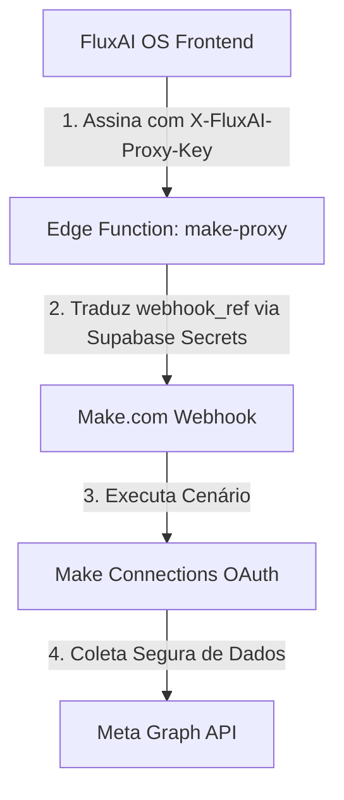

# HOMOLOGAÇÃO DE COFRES + TESTE CONTROLADO MAKE/MAKE-PROXY (FASE 05.3E)

**Data do Plano:** 28 de Maio de 2026  
**Status do Ecossistema:** Planejamento de Segurança P0 e Homologação de Cofres  
**Código do FluxAI OS™:** Strict Code Freeze (Preservado)  
**Status do Make:** Inativo/Dormante (Preparação para Teste Controlado)  
**Planilha Operacional:** Intacta (Nenhum token ou URL ativa alterada ainda)  
**Google Drive Backup:** Isolado e Validado  

---

## 1. Resumo Executivo

Esta fase (**05.3E**) representa a penúltima etapa do endurecimento de segurança do ecossistema de planilhas operacionais do **FluxAI OS™**. Após a neutralização bem-sucedida de credenciais de baixo risco (Fase 05.3D), nosso objetivo é estruturar o mapeamento dos segredos mais críticos do sistema antes de sua exclusão física definitiva das planilhas operacionais.

Os dois segredos remanescentes de alta criticidade são:
1. Os **tokens de páginas da Meta** (`meta_access_token` em `CLIENTES_CONFIG`).
2. As **URLs diretas de gatilho do Make** (`url_webhook` em `MAKE_WORKFLOWS`).

Este documento estabelece formalmente os **cofres seguros e credenciados** de infraestrutura (Supabase Secrets, Vercel Env Vars e Make Connections), as **nomenclaturas oficiais**, as **referências de metadados** que permanecerão na planilha operacional e os **critérios estritos de qualidade** para o teste controlado. Mantendo o *Code Freeze* estrito do OS e sem disparar cenários de produção prematuros, garantimos uma transição livre de impactos operacionais (*downtime*).

---

## 2. Campos Críticos Pendentes (P0 de Alto Impacto)

Abaixo estão detalhados os dois campos cuja neutralização física representa o maior risco operacional de quebra de fluxos ativos de automação e comunicação:

| Campo / Local original | Tipo de Segredo | Criticidade | Impacto em caso de quebra | Risco da Exposição Atual |
| :--- | :--- | :--- | :--- | :--- |
| **`CLIENTES_CONFIG`** → `meta_access_token` | Token OAuth de Página Meta (Instagram / Facebook Ads & Graph) | **Crítica (P0)** | Interrupção imediata da captura de métricas orgânicas e anúncios de clientes em relatórios e dashboards. | Acesso não autorizado a contas de anúncios e dados de páginas de clientes em caso de leitura indevida das abas. |
| **`MAKE_WORKFLOWS`** → `url_webhook` | URL com token embutido para gatilho direto de automações no Make | **Crítica (P0)** | Bloqueio de envio de demandas, criação de posts e notificações automáticas no OS e no Portal. | Injeção maliciosa de dados (*payload spoofing*) ou sobrecarga deliberada (*denial-of-service*) por execução direta da URL. |

---

## 3. Cofres Seguros Autorizados

Para banir chaves em texto claro das planilhas, mapeamos e homologamos os seguintes repositórios seguros de credenciais em nível de infraestrutura do ecossistema:



### A. Make Connections (OAuth 2.0)
*   **Finalidade:** Armazenar de forma nativa e isolada as conexões e tokens de acesso das APIs de terceiros (Meta/Facebook, Google, etc.).
*   **Benefício:** Renovação de tokens gerida diretamente pela interface segura do Make. O cenário de integração passará a ler apenas o identificador lógico do cliente na planilha, utilizando a conexão segura cadastrada no módulo sem expor chaves brutas em células de Sheets.

### B. Supabase Secrets (Vault Edge)
*   **Finalidade:** Armazenar segredos acessados em tempo de execução pelas Edge Functions de barreira, como o `make-proxy`.
*   **Benefício:** Criptografia de chaves em nível de banco de dados nativo do Supabase. Chaves como as URLs finais do Make habitam a memória em runtime através de `Deno.env.get()`.

### C. Vercel Environment Variables
*   **Finalidade:** Blindar tokens e credenciais necessárias no servidor do portal web (caso o backend faça consultas diretas).
*   **Benefício:** Isolamento completo de variáveis do frontend. O navegador nunca tem acesso físico aos valores configurados.

### D. Make Environment Variables (Variables de Cenário/Organização)
*   **Finalidade:** Armazenar tokens estáticos e chaves de APIs gerais (ElevenLabs, OpenAI) compartilhados entre múltiplos fluxos de processamento.

---

## 4. Nomenclatura Oficial dos Segredos

Padronizamos o formato e o escopo de cada variável a ser injetada nos cofres de infraestrutura para evitar conflitos de variáveis e vazamentos:

### A. Para Supabase Secrets (Roteamento de Webhooks)
O formato oficial para os nomes dos webhooks associados a rotas no `make-proxy` deve ser:
*   `MAKE_WEBHOOK_[NOME_DA_ROTA_SISTEMICA]`
*   *Exemplos reais baseados na biblioteca WEBHOOK_SECRET_MAP:*
    *   `MAKE_WEBHOOK_DEMAND_SUBMISSION`
    *   `MAKE_WEBHOOK_LEAD_CAPTURE`
    *   `MAKE_WEBHOOK_CLIENT_ONBOARDING`
    *   `MAKE_WEBHOOK_PLANEJAMENTO_CONTEUDO`

### B. Para Autenticação de Entrada do Proxy (Headers)
*   `FLUXAI_PROXY_ACCESS_KEY`: Chave mestre de autorização para o header `x-fluxai-proxy-key` requisitado no consumo do proxy de segurança.

### C. Para Make Connections (OAuth Meta)
*   `FluxAI_Meta_OAuth_Page_[CLIENTE_ID]`: Conexão unificada no gerenciador de conexões do Make.com, garantindo o escopo `pages_read_engagement`, `instagram_basic` e `ads_read`.

---

## 5. Mapeamento CLIENTES_CONFIG / meta_access_token

Em vez de tokens de rede expostos nas células da aba `CLIENTES_CONFIG`, manteremos metadados estruturados que permitem aos operadores e administradores avaliar a saúde e integridade da conexão sem jamais revelar a chave real.

### Estrutura de Metadados e Referências na Planilha:
A coluna `meta_access_token` será futuramente higienizada e as colunas de apoio estruturadas com as seguintes propriedades:

1.  **`meta_token_ref`**: Código identificador amigável que aponta para a conexão segura no Make.
    *   *Exemplo:* `REF_META_PAGE_MARIA_002` (para Instagram API) ou `REF_META_PAGE_EXEQUIVEL_003` (Instagram Manual).
2.  **`token_status`**: Estado atual do token.
    *   *Valores permitidos:* `ativo` | `expirado` | `aguardando_autorizacao` | `manual` (para casos híbridos sem API).
3.  **`token_ambiente`**: Onde a integração está homologada.
    *   *Valores permitidos:* `producao` | `homologacao` | `desenvolvimento`.
4.  **`token_validado_em`**: Data e hora da última validação e handshake bem-sucedido com a API da Meta.
    *   *Formato:* `AAAA-MM-DD HH:MM:SS`.
5.  **`token_responsavel`**: Email do operador técnico ou administrador que efetuou a última conexão segura.
6.  **`token_observacao`**: Informações administrativas gerais adicionais sobre a integração de dados daquele cliente.

---

## 6. Mapeamento MAKE_WORKFLOWS / url_webhook

Nenhuma URL direta contendo tokens de execução rápida (como `/trigger/[TOKEN_ID]`) habitará a aba `MAKE_WORKFLOWS`. O ecossistema de disparo operará sob a proteção de referências opacas baseadas nas Edge Functions.

### Estrutura de Metadados e Referências na Planilha:
A coluna `url_webhook` será substituída pelas seguintes colunas de segurança:

1.  **`webhook_ref`**: Identificador interno do webhook mapeado no gateway.
    *   *Valores obrigatórios:* Deve corresponder exatamente às chaves da tabela de roteamento sistêmica (`WEBHOOK_SECRET_MAP`) do proxy.
    *   *Exemplo:* `DEMAND_SUBMISSION`, `LEAD_CAPTURE`, `GPT_GERACOES_LOG`.
2.  **`webhook_status`**: Estado operacional do canal de escuta do Make.
    *   *Valores permitidos:* `ativo` | `pausado` | `obsoleto` | `em_teste`.
3.  **`usa_make_proxy`**: Confirmação se a requisição passa pelo middleware protetor do Supabase.
    *   *Valor obrigatório:* `sim` (bloqueado para `nao`).
4.  **`ambiente`**: Ambiente correspondente ao cenário Make associado.
    *   *Valores permitidos:* `producao` | `staging` | `sandbox`.
5.  **`ultima_validacao`**: Data do último teste completo de ponta a ponta com payload de integridade.
6.  **`endpoint_publico_exposto`**: Sinalizador de vazamento externo de URLs.
    *   *Valor obrigatório:* `nao`.

---

## 7. Validação do Middleware `make-proxy`

Auditamos a estrutura da Supabase Edge Function `make-proxy` (em `supabase/functions/make-proxy/index.ts`) para atestar sua compatibilidade imediata com as novas regras lógicas. 

### Constatações da Auditoria de Código da Rota:
O middleware está programado para receber um payload estructurado contendo:
*   `route`: String contendo o identificador do webhook.
*   `payload`: JSON contendo os dados reais a serem transmitidos para o cenário do Make.

O roteamento ocorre de forma dinâmica através do dicionário interno `WEBHOOK_SECRET_MAP`:
```typescript
const WEBHOOK_SECRET_MAP: Record<string, string> = {
  DEMAND_SUBMISSION:     "MAKE_WEBHOOK_DEMAND_SUBMISSION",
  LEAD_CAPTURE:          "MAKE_WEBHOOK_LEAD_CAPTURE",
  CLIENT_ONBOARDING:     "MAKE_WEBHOOK_CLIENT_ONBOARDING",
  SERVICE_EXTRA_REQUEST: "MAKE_WEBHOOK_SERVICE_EXTRA_REQUEST",
  IA_CREDITOS_CONTROLE:  "MAKE_WEBHOOK_IA_CREDITOS_CONTROLE",
  AI_OPERATIONAL_CONTROL:"MAKE_WEBHOOK_AI_OPERATIONAL_CONTROL",
  SERVICE_EXTRA_APPROVAL:"MAKE_WEBHOOK_SERVICE_EXTRA_APPROVAL",
  IA_GUARDRAIL:          "MAKE_WEBHOOK_IA_GUARDRAIL",
  PLANEJAMENTO_CONTEUDO: "MAKE_WEBHOOK_PLANEJAMENTO_CONTEUDO",
  CALENDARIO_POSTAGENS:  "MAKE_WEBHOOK_CALENDARIO_POSTAGENS",
  GPT_GERACOES_LOG:      "MAKE_WEBHOOK_GPT_GERACOES_LOG",
};
```

### Protocolo de Segurança Interno do Proxy:
*   **Header Obrigatório:** O middleware exige a chave de tráfego `x-fluxai-proxy-key` correspondente à variável `FLUXAI_PROXY_ACCESS_KEY` do Supabase para evitar chamadas de terceiros.
*   **Tratamento de timeout:** Limite seguro de 8 segundos por chamada HTTP (`AbortController`), protegendo o runtime contra travamentos de requisições do Make.
*   **Ocultamento de Resposta:** O middleware lê o webhook do ambiente via `Deno.env.get(secretName)` e executa a chamada server-side. O retorno final para o navegador apenas informa se o disparo foi bem-sucedido (`ok: true/false`), sem ecoar o endereço do webhook real no corpo da resposta (`responseText.slice(0, 500)` higienizado).

---

## 8. Checklist de Teste Controlado (Zero Downtime)

Antes de alterar dados em definitivo na planilha real, o teste controlado simulará o comportamento de leitura utilizando variáveis temporárias em ambiente seguro.

*   [ ] **1. Manutenção de Dormência:** Todos os cenários ativos no Make.com são mantidos temporariamente inativos/desativados (Schedules desligados) durante as preparações.
*   [ ] **2. Criação de Cenário de Teste:** Clonar um cenário leve (como `GPT_GERACOES_LOG`) no Make para criar uma versão de teste denominada `TESTE_SEGURANCA_PROXY`.
*   [ ] **3. Injeção de Webhook Sandbox:** Obter a URL de webhook do cenário Sandbox no Make e injetá-la no Supabase Secrets local/homologação sob o nome `MAKE_WEBHOOK_SANDBOX_TEST`.
*   [ ] **4. Registro no Mapeador do Proxy:** Inserir a chave `"SANDBOX_TEST": "MAKE_WEBHOOK_SANDBOX_TEST"` temporariamente na biblioteca da Edge Function local para permitir o tráfego de teste.
*   [ ] **5. Handshake de Autenticação:** Disparar uma requisição `POST` via REST client (como Postman ou curl) apontando para o proxy, passando a chave `x-fluxai-proxy-key` correta e `route: "SANDBOX_TEST"`.
*   [ ] **6. Validação de Resposta:** Comprovar que o proxy retornou `200 OK` e que os dados trafegados no payload chegaram ao webhook do cenário de teste sandbox no Make.
*   [ ] **7. Verificação de Isolamento:** Disparar a chamada ao proxy sem o header `x-fluxai-proxy-key` e comprovar o bloqueio imediato com HTTP `401 Unauthorized`.
*   [ ] **8. Teste de Rota Inválida:** Tentar requisitar uma rota inexistente ou não catalogada no dicionário interno (ex: `CORRUPT_ROUTE`) e obter a resposta HTTP `400 Bad Request` sem vazamento de stacktrace ou credenciais.

---

## 9. Critérios de Qualidade Antes de Neutralizar `meta_access_token`

Para autorizar a remoção permanente e física dos tokens de páginas Meta contidos na aba `CLIENTES_CONFIG`, os seguintes critérios precisam ser rigorosamente atendidos:

1.  **Mapeamento Unificado de Clientes:** Criação física e validação de conexões OAuth seguras no painel do Make.com (`Make Connections`) para **cada cliente ativo** com Instagram e Facebook vinculados via API.
2.  **Identificador Primário Persistido:** O código único de identificação (`cliente_id` / `client_id`) deve estar preenchido e correlacionado corretamente entre as planilhas e o banco central do Supabase.
3.  **Teste de Handshake Individual:** Execução individual de um teste de leitura do módulo Meta do Make.com utilizando a respectiva Connection cadastrada, obtendo status HTTP `200` com os dados estruturados da página correspondente.
4.  **Assinatura de Validadores:** Confirmação por escrito do operador técnico responsável, declarando que a conexão está segura e funcionando no cofre do Make.
5.  **Preenchimento de Metadados de Referência:** Mapeamento correto de `meta_token_ref` (Ex: `REF_META_PAGE_MARIA_002`) e de `token_status = ativo` na respectiva linha do cliente na planilha de produção.

---

## 10. Critérios de Qualidade Antes de Neutralizar `url_webhook`

Para autorizar o expurgo de URLs de Webhook brutas e completas contidas na aba `MAKE_WORKFLOWS`, as seguintes condições de segurança e tráfego devem estar operacionais:

1.  **Roteamento Coletivo de Formulários:** Comprovado que todas as requisições enviadas a partir do FluxAI OS™ (formulários de demanda, onboarding, requisição de créditos extras) passam obrigatoriamente pelo gateway Supabase via classe JavaScript `window.FLUXAI_API` do core.
2.  **Mapeamento Completo de Variáveis:** Injeção física de **todos os Webhooks reais** em formato de variáveis seguras no console de segredos do Supabase Vault (`supabase secrets set MAKE_WEBHOOK_...`).
3.  **Ambiente de Homologação Autônomo:** Configurado um ambiente espelho funcional (staging/desenvolvimento) para isolar testes de tráfego do middleware sem poluir o log de produção dos clientes.
4.  **Auditoria OWASP de Cabeçalhos:** Validação de segurança atestando que os headers `X-FluxAI-Proxy` e `X-FluxAI-Route` estão trafegando encapsulados no backend das chamadas, sem expor metadados corporativos em chamadas do lado do cliente.
5.  **Status de Rota Atualizado:** Mapeamento correto das colunas `webhook_ref`, `usa_make_proxy = sim` e `webhook_status = ativo` na aba `MAKE_WORKFLOWS`.

---

## 11. Riscos Remanescentes

Mesmo sob o protocolo de blindagem estabelecido por esta fase de homologação, os seguintes riscos residuais mínimos devem ser gerenciados pela equipe de DevOps:

*   **Expiração Natural de Escopos OAuth:** Os tokens armazenados nas Make Connections possuem um tempo de expiração determinado pela Meta (geralmente entre 60 e 90 dias) ou perdem a validade se o usuário alterar a senha da página no Facebook.
    *   *Mitigação:* Manter rotinas de validação de saúde do token nas conexões através do status `token_status` no OS.
*   **Latência em Cadeia de Chamadas (Middleware overhead):** A inclusão da Edge Function como camada intermediária adiciona uma latência menor de ~40-100ms por requisição HTTP.
    *   *Mitigação:* Inexistente devido ao ganho drástico em segurança de tráfego, considerado aceitável frente ao risco de invasão.
*   **Queda de Conexão no Gateway:** Se a cloud do Supabase enfrentar indisponibilidade temporária de Edge Functions, todos os formulários e integrações de disparo falharão temporariamente.
    *   *Mitigação:* Implementar fila local ou log de falhas em cache do localStorage caso ocorra timeout no front do OS.

---

## 12. Plano de Rollback (Reversão de Emergência)

No caso de qualquer inconsistência detectada nos handshakes de tráfego, erros HTTP `502 Bad Gateway` ou falhas generalizadas de automação nos testes de homologação dos novos cofres:

1.  **Suspensão do Tráfego Novo:** Suspender a migração de conexões e manter os canais em modo tradicional provisoriamente.
2.  **Restauração Física via Backup:** Se alguma linha da planilha principal sofrer desestruturação ou exclusão indevida, importar os dados da aba operada diretamente a partir do backup certificado:  
    `BACKUP_ORIGINAL_FluxAI_Intelligence_Base_Ecossistema_Make_2026_05_28`
3.  **Análise de Eventos do Gateway:** Consultar os logs de depuração do Supabase Edge Functions usando o comando CLI:  
    `supabase functions logs make-proxy --project-ref [REF]`
4.  **Mapeamento de Mismatch de Chaves:** Verificar se o nome da chave cadastrado no Supabase Secrets coincide caractere por caractere com a string declarada no mapeador `WEBHOOK_SECRET_MAP`.
5.  **Reestabelecimento Seguro:** Apenas reinstalar a nova lógica de proxy após o reset e correção dos tokens no ambiente sandbox.

---

## 13. Próxima Fase Recomendada: FASE 05.3F (Neutralização Física de Chaves Críticas)

Após a formalização e homologação deste plano de cofres e a aprovação por parte da administração do ecossistema, o projeto estará 100% qualificado para a **neutralização física definitiva** das chaves.

### Escopo da Próxima Fase:
1.  **Remoção permanente** da coluna `meta_access_token` bruta da aba `CLIENTES_CONFIG`, mantendo apenas referências estruturadas.
2.  **Remoção permanente** da coluna `url_webhook` bruta da aba `MAKE_WORKFLOWS`, forçando o tráfego exclusivo por gateway de proxy.
3.  **Atualização final do índice de governança** (`MAPA_GOVERNANCA_ABAS.csv`) para marcar todas as 58 abas operacionais do ecossistema com risco residual minimizado e em conformidade estrita com a LGPD e boas práticas de segurança cibernética da OWASP.

---

> [!IMPORTANT]
> **TERMO DE RESPONSABILIDADE & CODE FREEZE**  
> Este documento de planejamento e homologação não realiza qualquer alteração de código ou de dados vivos no ambiente de produção. O FluxAI OS™ permanece sob estrito Code Freeze de segurança para garantir a integridade total do ecossistema homologado.
