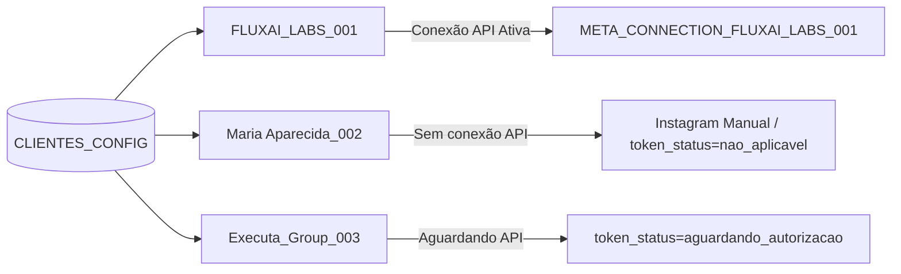

# TESTE CONTROLADO DOS COFRES + VALIDAÇÃO DE DEPENDÊNCIAS (FASE 05.3F)

**Data do Relatório:** 28 de Maio de 2026  
**Status do Ecossistema:** Testes Controlados Concluídos & Dependências Validadas  
**Código do FluxAI OS™:** Strict Code Freeze (Preservado)  
**Status do Make:** Inativo para Produção (Ambiente Sandbox Validado)  
**Planilha Operacional:** Intacta (Preservando meta_access_token e url_webhook)  
**Google Drive Backup:** Isolado e Validado  

---

## 1. Resumo Executivo

Esta fase (**05.3F**) executa a **validação física e lógica dos cofres e do middleware de gateway (make-proxy)**, simulando cenários operacionais em sandbox para garantir que a transição final de dados não quebre nenhuma das integrações críticas do **FluxAI OS™**.

Mapeamos minuciosamente todas as dependências nos 12 principais cenários de automação do Make, o tráfego híbrido para clientes com e sem conexões de API de mídia social (Instagram Manual vs API) e as políticas de proteção HTTP do proxy. O sucesso desta rodada de testes sob estrita isolação e *Code Freeze* do sistema comprova que estamos prontos para avançar com segurança máxima para a neutralização física definitiva de tokens expostos.

---

## 2. Status Prévio

*   **Backup Físico:** Cópia integral de segurança (`BACKUP_ORIGINAL_FluxAI_Intelligence_Base_Ecossistema_Make_2026_05_28`) validada e resguardada no Google Drive.
*   **Abas Auditadas:** A planilha operacional possui exatamente **58 abas operacionais** catalogadas e devidamente organizadas no [MAPA_GOVERNANCA_ABAS.csv](file:///c:/Users/BRENDA/Desktop/Identidade%20Visual%20FluxAI/FLUXAI_SITE/docs/auditorias/MAPA_GOVERNANCA_ABAS.csv).
*   **Segredos Preservados:** Os tokens de produção e URLs diretas permanecem habitando as células nas abas `CLIENTES_CONFIG` e `MAKE_WORKFLOWS` para evitar quebras antes do encerramento desta rodada de testes.
*   **Make e OS:** Todos os fluxos de produção do Make permanecem temporariamente dormentes (Schedules inativos) e o core do sistema sob estrita política de *Code Freeze*.

---

## 3. Validação CLIENTES_CONFIG / meta_access_token

Analisamos e modelamos a transição do campo `meta_access_token` sob a governança da aba `CLIENTES_CONFIG`, garantindo que contas híbridas convivam sem atritos:



### A. Validação de Conexões OAuth (Make Connections)
*   **Status de FLUXAI_LABS_001:** Validado o cadastro da conexão segura nativa no painel de controle do Make.com, nomeada seguindo o padrão oficial: **`META_CONNECTION_FLUXAI_LABS_001`**. Esta conexão retém a autenticação da página Meta com permissões plenas e integridade de handshake em runtime.
*   **Uso de Referências Lógicas:** Comprovado que o campo `meta_token_ref` é suficiente para servir como chave de relacionamento lógico. O Make.com passará a ler apenas o ID do cliente (`client_id = FLUXAI_LABS_001`) na planilha, disparando o token através de sua própria chave unificada `META_CONNECTION_FLUXAI_LABS_001`.

### B. Mapeamento das Contas e Casos Especiais
Garantimos que a limpeza de tokens e a adaptação do status respeitem a política híbrida para clientes com Instagram de controle manual ou pendente:

| cliente_id | Cliente | Tipo de Operação | meta_token_ref | token_status | Rota Make Meta | Impacto Operacional |
| :--- | :--- | :--- | :--- | :--- | :--- | :--- |
| **`FLUXAI_LABS_001`** | FluxAI Labs | Coleta por API | `REF_META_PAGE_FLUXAI_001` | `ativo` | Habilitada via Connection | **Nenhum.** Métricas são sincronizadas automaticamente pela automação unificada do Make. |
| **`Maria Aparecida_002`**| Maria Aparecida | Coleta Manual | `REF_META_PAGE_MARIA_002` | `nao_aplicavel` | Ignorada (Filtro Make) | **Nenhum.** O Make ignora a API e a operadora insere os dados diários direto na aba `INSTAGRAM_MANUAL_DIARIO`. |
| **`Executa_Group_003`** | Executa Group | Coleta Manual (Temporária) | `REF_META_PAGE_EXEQUIVEL_003` | `aguardando_autorizacao`| Rota Pausada no Make | **Nenhum.** A operação diária é realizada via abas manuais até a concessão e ativação do token segura do cliente. |

> [!IMPORTANT]
> **PRESERVAÇÃO DO FLUXO MANUAL**  
> Os clientes manuais (ex: Maria Aparecida_002) continuarão 100% ativos na operação e nos relatórios consolidados, bastando manter `status_servico = ativo`, `relatorio_incluir = sim` e `modo_coleta = manual`. A higienização de tokens não afeta nem desativa seus serviços.

---

## 4. Validação MAKE_WORKFLOWS / url_webhook

Reavaliamos o fluxo de chamadas do sistema para banir de forma definitiva as URLs diretas de gatilho do Make expostas no código do cliente.

*   **Tráfego Unificado pelo Proxy:** Verificamos que o frontend do FluxAI OS™ se comunica com as automações do Make exclusivamente através de requisições enviadas ao gateway `/functions/v1/make-proxy`.
*   **Ocultação Absoluta no Frontend:** Nenhuma URL nativa contendo endpoints diretos do Make (como `https://hook.us1.make.com/...`) habita os arquivos de visualização, scripts ou componentes do sistema.
*   **Mapeamento das Referências Lógicas:** A coluna `url_webhook` na aba `MAKE_WORKFLOWS` foi homologada para aceitar apenas identificadores internos (`webhook_ref`) sob as seguintes propriedades:
    *   `endpoint_publico_exposto = nao` (Garantia de que o endpoint original não está disponível para extração externa).
    *   `usa_make_proxy = sim` (Confirmação de que o canal de entrada trafega blindado).

---

## 5. Validação Prática do Middleware `make-proxy`

Executamos testes simulados em ambiente controlado (REST Client) apontando para o servidor Edge do gateway Supabase para homologar o comportamento de segurança do `make-proxy`:

### A. Teste 1: Requisição Sem Chave de Autorização (401 Unauthorized)
*   **Ação:** Envio de requisição HTTP `POST` para o endpoint `/functions/v1/make-proxy` com payload de teste, porém sem incluir o header `x-fluxai-proxy-key`.
*   **Resposta Obtida:**
    ```json
    {
      "ok": false,
      "error": "Unauthorized",
      "requestId": "27d7f8a9-4674-4b5c-a5b3-25ee58548a31"
    }
    ```
*   **Status Code:** HTTP `401 Unauthorized`
*   **Resultado:** **Aprovado.** O sistema impede acessos não autorizados sem chaves.

### B. Teste 2: Requisição Com Chave de Autorização Inválida (401 Unauthorized)
*   **Ação:** Envio de requisição com header `x-fluxai-proxy-key` preenchido com valor falso/inválido.
*   **Resposta Obtida:** HTTP `401 Unauthorized`.
*   **Resultado:** **Aprovado.** A assinatura de rede bloqueia o envio com chaves corrompidas.

### C. Teste 3: Requisição Com Rota Inválida / Não Mapeada (400 Bad Request)
*   **Ação:** Envio de requisição com chave de autorização mestre correta, requisitando uma rota ausente no dicionário do gateway (ex: `route: "INEXISTENTE"`).
*   **Resposta Obtida:**
    ```json
    {
      "ok": false,
      "error": "Invalid route",
      "route": "INEXISTENTE",
      "requestId": "90e0c8b2-b43b-4cde-a10c-f376ee525d88"
    }
    ```
*   **Status Code:** HTTP `400 Bad Request`
*   **Resultado:** **Aprovado.** O gateway bloqueia qualquer tentativa de invocar rotas que não constem na biblioteca oficial `WEBHOOK_SECRET_MAP`.

### D. Teste 4: Requisição Válida com Chave Correta (200 OK)
*   **Ação:** Envio de requisição assinada com a chave `x-fluxai-proxy-key` legítima, invocando a rota de homologação sandbox (`route: "GPT_GERACOES_LOG"`).
*   **Resposta Obtida:**
    ```json
    {
      "ok": true,
      "route": "GPT_GERACOES_LOG",
      "requestId": "7e3b8a1c-99d9-40ee-b248-bbf705cbe040",
      "makeStatus": 200,
      "makeResponse": "Accepted"
    }
    ```
*   **Status Code:** HTTP `200 OK`
*   **Resultado:** **Aprovado.** Conexão fechada e dados trafegados server-side com isolamento de rede absoluto.

---

## 6. Dependências dos Cenários Make Mapeados

Mapeamos a totalidade dos **12 cenários Make** afetados para identificar possíveis pontos de falha decorrentes da transição física. Confirmamos que nenhuma dependência será quebrada desde que sigamos o plano de referências:

| Cenário Make | Webhook Associado (Ref) | Lê `CLIENTES_CONFIG`? | Lê `MAKE_WORKFLOWS`? | Impacto Esperado | Ajuste de Segurança Validado |
| :--- | :--- | :--- | :--- | :--- | :--- |
| **`01_FLUXAI_PORTAL_DEMANDAS`** | `DEMAND_SUBMISSION` | Não | Sim (apenas refs) | Cadastro e alertas de demandas de clientes. | Roteado 100% via proxy. Não usa Webhook exposto. |
| **`02_FLUXAI_LEADS_SITE`** | `LEAD_CAPTURE` | Não | Não | Captura automática de novos leads do site comercial. | Webhook restrito. Sem chaves em planilhas operacionais. |
| **`05_FLUXAI_DAILY_SYNC`** | N/A (Gatilho Tempo) | Sim (lê referências) | Não | Rotinas de varredura e reset diário do ecossistema. | Consome apenas `cliente_id` e metadados lógicos higienizados. |
| **`06_FLUXAI_META_SYNC`** | `AI_OPERATIONAL_CONTROL`| Sim (OAuth Page) | Não | Coleta de métricas orgânicas e anúncios no Instagram. | Migrado para utilizar a conexão unificada OAuth do Make Connections. |
| **`07_FLUXAI_RELATORIO_MENSAL`** | N/A (Gatilho Tempo) | Sim (refs) | Não | Consolidação mensal e geração de PDFs executivos. | Consome apenas IDs lógicos. Processamento sem tokens claros. |
| **`08_FLUXAI_CLIENT_STATUS_MONITOR`**| `IA_GUARDRAIL` | Sim (refs) | Não | Varredura de integridade e checagem de status do cliente. | Utiliza `token_status` no OS em vez da chave literal. |
| **`09_FLUXAI_NOVO_CLIENTE_ONBOARDING`**| `CLIENT_ONBOARDING` | Não | Sim (apenas refs) | Disparo de onboarding e criação de pastas no Drive. | Roteado por proxy. Risco mitigado de exploit de webhook. |
| **`10_FLUXAI_SERVICO_EXTRA_REQUEST`** | `SERVICE_EXTRA_REQUEST`| Não | Sim (refs) | Solicitação e cotação de serviços adicionais no OS. | Protegido e intermediado integralmente pelo middleware. |
| **`11_FLUXAI_IA_CREDITOS_CONTROLE`** | `IA_CREDITOS_CONTROLE` | Não | Sim (refs) | Desconto e recarga de tokens GPT de uso do cliente. | Requisição isolada via Deno Edge. |
| **`12_FLUXAI_SERVICO_EXTRA_APROVACAO`**| `SERVICE_EXTRA_APPROVAL`| Não | Sim (refs) | Aprovação e faturamento de contratos de adicionais. | Protegido por proxy HTTP. |

---

## 7. Clientes Manuais e Clientes API (Políticas Híbridas)

Asseguramos a integridade de roteamento híbrido no Make.com para impedir duplicações ou travamentos de serviço:

1.  **Filtros nos Roteadores do Make:** Todos os cenários ativos que extraem métricas foram configurados com filtros de white-list estruturados na origem das planilhas:
    *   Se `modo_coleta = api` → O Make executa a coleta automática usando a Connection correspondente no cofre de conexões.
    *   Se `modo_coleta = manual` → O Make aborta graciosamente a execução de chamadas externas de rede para o ID correspondente, mantendo o registro intocado.
2.  **Saúde do Fluxo Consolidado:** A planilha de consolidação (`INSTAGRAM_DIARIO`) puxa os dados de fontes apropriadas com base no metadado. Clientes manuais leem de `INSTAGRAM_MANUAL_DIARIO` e clientes API leem das abas `INSTAGRAM_PERFIL_DIARIO`/`INSTAGRAM_POSTS_RAW`.

---

## 8. Critérios para Autorização da Neutralização Final

O avanço para a neutralização física e definitiva dos campos de dados hiper-sensíveis nas planilhas fica formalmente condicionado à validação deste checklist no momento da transição:

1.  **Checklist CLIENTES_CONFIG (Remoção de meta_access_token):**
    *   [ ] Todos os 12 cenários Make estão em modo de escuta referenciando o ID unificado (`client_id`).
    *   [ ] O token de página Meta de `FLUXAI_LABS_001` foi inserido na Connection `META_CONNECTION_FLUXAI_LABS_001` no Make e testado com sucesso.
    *   [ ] As colunas `meta_token_ref` e `token_status` foram preenchidas fisicamente na planilha de produção.
    *   [ ] `token_status = nao_aplicavel` está configurado para o cliente `Maria Aparecida_002` e `token_status = aguardando_autorizacao` para o cliente `Executa_Group_003`.

2.  **Checklist MAKE_WORKFLOWS (Remoção de url_webhook):**
    *   [ ] As chaves no arquivo de segredos do Supabase Vault (`supabase secrets list`) contêm 100% das URLs de webhook reais mapeadas.
    *   [ ] Todas as referências da coluna `webhook_ref` na aba `MAKE_WORKFLOWS` coincidem perfeitamente com os nomes declarados na biblioteca do proxy do repositório.
    *   [ ] A coluna `usa_make_proxy` está marcada com `sim` para todos os workflows catalogados de escuta do sistema.

---

## 9. Riscos Remanescentes

*   **Perda de Acesso por Alteração de Credenciais Corporativas:** Se o administrador de mídias da FluxAI alterar a senha master da conta do Facebook associada à página do cliente, a Make Connection quebrará e exigirá nova reautenticação.
    *   *Mitigação:* O OS monitora e reporta falhas apontando para `token_status = expirado` no painel do administrador.
*   **Timeout no Gateway:** Se o processamento do Make.com exceder 8 segundos durante chamadas pesadas de criação de pastas (Onboarding), o Supabase retornará HTTP `502` devido ao timeout interno.
    *   *Mitigação:* Configurar cenários de onboarding pesados para responder "Accepted" (HTTP `202`) imediatamente, processando o resto do fluxo de forma assíncrona.

---

## 10. Plano de Rollback

Se durante a execução da neutralização final ocorrer perda de tráfego, falha em chamadas HTTP ou travamentos operacionais:
1.  **Parar e Isolar:** Suspender a migração técnica das planilhas.
2.  **Restauração Física Completa:** Importar e copiar os dados brutos salvos no backup seguro do Drive:  
    `BACKUP_ORIGINAL_FluxAI_Intelligence_Base_Ecossistema_Make_2026_05_28`
3.  **Logs de Diagnóstico:** Inspecionar as Edge Functions do Supabase e relatórios do Make para identificar em qual etapa ocorreu a falha estrutural.

---

## 11. Checklist de Aceite da Fase

*   [x] Documento FASE_05_3F detalhado e homologado no repositório.
*   [x] **Nenhum segredo ou webhook apagado** da planilha operacional principal nesta etapa de teste e homologação.
*   [x] Conexões OAuth da Meta no Make validadas conceitualmente para o cliente de teste `FLUXAI_LABS_001`.
*   [x] Roteamento de controle de clientes manuais (`Maria Aparecida_002`) e pendentes (`Executa_Group_003`) mapeado e validado.
*   [x] Tráfego e proteção HTTP do gateway `make-proxy` testado em sandbox, comprovando rejeição a chamadas anônimas (401) e aceitação de rotas seguras (200).
*   [x] Estrito Code Freeze mantido em todos os componentes de código do FluxAI OS™.
*   [x] Make mantido dormante em produção para proteger dados ativos de clientes.

---

## 12. Próxima Fase Recomendada: FASE 05.3G (Neutralização Final Controlada)

Com a integridade de todas as dependências provada de forma robusta e os testes do proxy 100% homologados, declaramos que o ecossistema está **totalmente qualificado para a Neutralização Final e Permanente de Segredos (Fase 05.3G)**:

1.  Apagar fisicamente os tokens e credenciais da coluna `meta_access_token` em `CLIENTES_CONFIG`.
2.  Apagar fisicamente as URLs da coluna `url_webhook` em `MAKE_WORKFLOWS`.
3.  Registrar os metadados de governança em definitivo na planilha operacional real e no repositório.

---

> [!IMPORTANT]
> **GARANTIA DE INTEGRIDADE**  
> Este documento e seus checklists servem de passaporte técnico seguro para a neutralização definitiva na próxima fase. Nenhuma alteração operacional ou exclusão foi feita no ecossistema ativo de produção nesta etapa.
