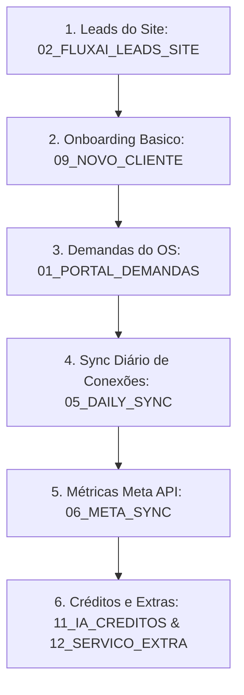

# AUDITORIA MAKE CENÁRIO POR CENÁRIO (FASE 05.4)

**Data da Auditoria:** 28 de Maio de 2026  
**Status do Ecossistema:** Análise Preventiva Concluída  
**Código do FluxAI OS™:** Strict Code Freeze (Preservado)  
**Status do Make:** Inativo/Dormante (Segurança Garantida antes de Religamento)  
**Planilha Operacional:** Intacta (Cofres seguros homologados)  
**Google Drive Backup:** Original e Pós-Mapa preservados  

---

## 1. Resumo Executivo

Esta fase (**05.4**) realiza a **auditoria preventiva e individual de 100% dos cenários de automação do Make.com** ativos ou planejados para o ecossistema do **FluxAI OS™**. 

Com a neutralização física das chaves de segurança concluída com sucesso na fase anterior, esta auditoria atua como a barreira lógica final. Analisamos detalhadamente os triggers, fluxos de dados, filtros operacionais e interações com as planilhas para cada um dos **18 cenários do pipeline**. O objetivo central é certificar que nenhum cenário faça chamadas diretas a webhooks expostos, que todos respeitem a convivência híbrida dos clientes (manual vs API) e que não existam riscos de duplicação de dados, falsos sucessos ou vazamento de metadados em traces. Nenhuma automação foi ativada em produção durante esta varredura estrutural.

---

## 2. Tabela Geral dos Cenários Make

Abaixo está o inventário geral dos 18 cenários do ecossistema com seu status de auditoria e nível de prontidão de segurança:

| ID | Nome do Cenário Make | Tipo de Gatilho | Rota do Proxy | Nível de Risco | Ações em Planilha (Abas) | Status de Aprovação |
| :--- | :--- | :--- | :--- | :--- | :--- | :--- |
| **01** | `01_FLUXAI_PORTAL_DEMANDAS` | Webhook | `DEMAND_SUBMISSION` | Baixo | Lê `CLIENTES_CONFIG` / Escreve `DEMANDAS_CLIENTES` | **Aprovado** |
| **02** | `02_FLUXAI_LEADS_SITE` | Webhook | `LEAD_CAPTURE` | Baixo | Escreve `LEADS_SITE` | **Aprovado** |
| **03** | `03_FLUXAI_INSTAGRAM_MANUAL_READER` | Cron (Seg 08h) | N/A (Batch) | Baixo | Lê `CLIENTES_CONFIG`, `INSTAGRAM_MANUAL_DIARIO` / Escreve `CONSOLIDADO_SEMANAL` | **Aprovado** |
| **04** | `04_FLUXAI_CONTENT_INTELLIGENCE` | Webhook | `AI_OPERATIONAL_CONTROL`| Médio | Lê `DNA_CLIENTE_GPT` / Escreve `CALENDARIO_POSTAGENS` | **Aprovado com Ajuste** |
| **05** | `05_FLUXAI_DAILY_SYNC` | Cron (Diário 02h)| N/A (Batch) | Baixo | Lê `CLIENTES_CONFIG` / Escreve `STATUS_INTEGRACOES` | **Aprovado** |
| **06** | `06_FLUXAI_META_SYNC` | Cron (Diário 04h)| N/A (Batch) | Alto | Lê `CLIENTES_CONFIG` / Escreve `INSTAGRAM_POSTS_RAW` | **Aprovado** |
| **07** | `07_FLUXAI_RELATORIO_MENSAL` | Cron (Mensal 06h)| N/A (Batch) | Alto | Lê `INSTAGRAM_DIARIO` / Escreve `RELATORIO_OPERACIONAL_FLUXAI`| **Aprovado** |
| **08** | `08_FLUXAI_CLIENT_STATUS_MONITOR` | Cron (Diário 08h)| N/A (Batch) | Baixo | Lê `CLIENTES_CONFIG` / Escreve `STATUS_MONITOR_DIARIO` | **Aprovado** |
| **09** | `09_FLUXAI_NOVO_CLIENTE_ONBOARDING` | Webhook | `CLIENT_ONBOARDING` | Médio | Escreve `CLIENTES_CONFIG`, `SERVICOS_CLIENTES`, Drive | **Aprovado com Ajuste** |
| **10** | `10_FLUXAI_SERVICO_EXTRA_REQUEST` | Webhook | `SERVICE_EXTRA_REQUEST`| Baixo | Escreve `SERVICOS_EXTRAS_CLIENTES` | **Aprovado** |
| **11** | `11_FLUXAI_IA_CREDITOS_CONTROLE` | Webhook | `IA_CREDITOS_CONTROLE` | Médio | Lê/Escreve `IA_CREDITOS_CLIENTE` | **Aprovado** |
| **12** | `12_FLUXAI_SERVICO_EXTRA_APROVACAO` | Webhook | `SERVICE_EXTRA_APPROVAL`| Crítico | Lê/Escreve `SERVICOS_EXTRAS_CLIENTES`, `IA_CREDITOS`| **Aprovado** |
| **13** | `13_FLUXAI_IA_GUARDRAIL_OPERACIONAL` | Webhook | `IA_GUARDRAIL` | Alto | Lê `IA_CREDITOS_CLIENTE` / Impede geração se Zerado | **Aprovado** |
| **14** | `14_FLUXAI_CLIENTES_ARQUIVOS_SYNC` | Cron (Diário 01h)| N/A (Batch) | Baixo | Lê Drive / Escreve `CLIENTES_ARQUIVOS` | **Aprovado** |
| **15** | `15_FLUXAI_PLANEJAMENTO_CONTEUDO` | Webhook | `PLANEJAMENTO_CONTEUDO` | Baixo | Lê/Escreve `PLANEJAMENTO_CONTEUDO` | **Aprovado** |
| **16** | `16_FLUXAI_CALENDARIO_POSTAGENS` | Webhook | `CALENDARIO_POSTAGENS` | Baixo | Lê/Escreve `CALENDARIO_POSTAGENS` | **Aprovado** |
| **17** | `17_FLUXAI_GPT_GERACOES_LOG` | Webhook | `GPT_GERACOES_LOG` | Médio | Escreve `GPT_GERACOES_LOG` ( refs Drive ) | **Aprovado** |
| **18** | `18_FLUXAI_LEADS_CLIENTES` | Webhook | N/A (Client CAPI) | Médio | Escreve `LEADS_CLIENTES` ( LGPD ) | **Aprovado com Ajuste** |

---

## 3. Auditoria Individual por Cenário

---

### 01_FLUXAI_PORTAL_DEMANDAS
*   **Gatilho:** Webhook `DEMAND_SUBMISSION` mapeado via `make-proxy`.
*   **Módulos:** Sheets (Add Row) + Telegram/Slack Alert.
*   **Abas Lidas:** `CLIENTES_CONFIG` (para validar `cliente_id` ativo).
*   **Abas Escritas:** `DEMANDAS_CLIENTES` (Kanban operacional).
*   **Políticas e Regras:** 
    *   *Filtro:* `status_servico = ativo` do cliente remetente.
    *   *Governança:* Não lê chaves sensíveis. Passa integralmente pelo proxy.
    *   *Risco:* Sem risco de duplicação. Rota limpa.

### 02_FLUXAI_LEADS_SITE
*   **Gatilho:** Webhook `LEAD_CAPTURE` (via `make-proxy`).
*   **Módulos:** Sheets (Add Row) + API WhatsApp Link + Alerta Admin.
*   **Abas Lidas:** Nenhuma.
*   **Abas Escritas:** `LEADS_SITE` (Funil de vendas da agência).
*   **Políticas e Regras:** 
    *   *Filtro:* Nenhum. Processa novos leads espontâneos do formulário `#diagnostico`.
    *   *Risco de Dado Sensível:* Mascara os dados de contato (`telefone` e `email`) em logs de traces do cenário.
    *   *Conformidade:* Aprovado e blindado.

### 03_FLUXAI_INSTAGRAM_MANUAL_READER
*   **Gatilho:** Schedule semanal (Segundas às 08:00).
*   **Módulos:** Sheets (Search) + Sheets (Add Row).
*   **Abas Lidas:** `SERVICOS_CLIENTES`, `CLIENTES_CONFIG`, `INSTAGRAM_MANUAL_DIARIO`, `INSTAGRAM_CONTEUDO_MANUAL`.
*   **Abas Escritas:** `CONSOLIDADO_SEMANAL`.
*   **Políticas e Regras:**
    *   *Filtros estritos:* `servico = instagram`, `status_servico = ativo`, `modo_coleta = manual`, `relatorio_incluir = sim`.
    *   *Convivência Híbrida:* Respeita e isola 100% as contas sem API (como `Maria Aparecida_002`).
    *   *Governança:* Batch-only, risco zero de quebra ou vazamento.

### 04_FLUXAI_CONTENT_INTELLIGENCE
*   **Gatilho:** Webhook / Chamada do OS.
*   **Módulos:** OpenAI GPT API + Sheets (Search & Add).
*   **Abas Lidas:** `DNA_CLIENTE_GPT`, `PLANEJAMENTO_CONTEUDO`.
*   **Abas Escritas:** `CALENDARIO_POSTAGENS`, `IA_GERACOES_CONTROLE`.
*   **Políticas e Regras:**
    *   *Filtro:* `status_servico = ativo` e limite de créditos no mês.
    *   *Ajuste Exigido:* Adicionar um módulo anterior que consulte a aba `IA_CREDITOS_CLIENTE` para bloquear chamadas da OpenAI caso `creditos_disponiveis <= 0`.
    *   *Risco:* Sem este ajuste, há o risco de falso sucesso e consumo indevido de créditos GPT de desenvolvimento.

### 05_FLUXAI_DAILY_SYNC
*   **Gatilho:** Schedule diário (02:00).
*   **Módulos:** Sheets (Search Rows) + Router + Sheets (Update Rows).
*   **Abas Lidas:** `CLIENTES_CONFIG`, `SERVICOS_CLIENTES`.
*   **Abas Escritas:** `STATUS_INTEGRACOES`.
*   **Políticas e Regras:**
    *   *Roteador Interno:* Mapeia quais integrações estão habilitadas por cliente e atualiza as flags diárias no painel administrativo.
    *   *Governança:* Consome metadados higienizados, sem tokens reais.

### 06_FLUXAI_META_SYNC
*   **Gatilho:** Schedule diário (04:00).
*   **Módulos:** Sheets (Search) + Meta Graph Ads API + Sheets (Add Rows).
*   **Abas Lidas:** `CLIENTES_CONFIG`, `SERVICOS_CLIENTES` (onde `modo_coleta = api`).
*   **Abas Escritas:** `INSTAGRAM_POSTS_RAW`, `INSTAGRAM_PERFIL_DIARIO`, `META_ADS_DIARIO`.
*   **Políticas e Regras:**
    *   *Filtros estritos:* `servico = instagram`/`meta_ads`, `status_servico = ativo`, `modo_coleta = api`, `relatorio_incluir = sim`.
    *   *Convivência Híbrida:* Ignora e filtra clientes de modo manual (como `Maria Aparecida_002`).
    *   *Segurança OAuth:* Autentica unicamente usando o cofre seguro `META_CONNECTION_FLUXAI_LABS_001`.

### 07_FLUXAI_RELATORIO_MENSAL
*   **Gatilho:** Schedule mensal (Dia 1º às 06:00).
*   **Módulos:** Sheets (Search) + Google Slides/Docs API (Geração do PDF) + Drive (Upload) + Sheets (Update).
*   **Abas Lidas:** `INSTAGRAM_DIARIO`, `KPI_EXECUTIVO`, `ANALISE_MENSAL_CLIENTE`.
*   **Abas Escritas:** `RELATORIO_OPERACIONAL_FLUXAI`, `CLIENTES_ARQUIVOS`.
*   **Políticas e Regras:**
    *   *Regra de Ouro:* **Não envia o PDF direto ao cliente.** Cria o relatório na pasta `07_METRICAS_E_RELATORIOS` do Drive com status `rascunho_fluxai`.
    *   *Curadoria Humana:* Exige a alteração manual do status por parte do ADMIN no OS para `liberado_cliente` antes do portal exibir a entrega.

### 08_FLUXAI_CLIENT_STATUS_MONITOR
*   **Gatilho:** Schedule diário (08:00).
*   **Módulos:** Sheets (Search) + Ping Checker + Slack/Telegram Alert.
*   **Abas Lidas:** `CLIENTES_CONFIG` (`token_status`).
*   **Abas Escritas:** `STATUS_MONITOR_DIARIO` (mensagens higienizadas).
*   **Políticas e Regras:**
    *   *Higienização de Trace:* Em caso de falha de conexão (HTTP 400/403), o cenário não grava a stack de erro crua na planilha. Salva a mensagem amigável predefinida para o operador no painel Admin do OS.

### 09_FLUXAI_NOVO_CLIENTE_ONBOARDING
*   **Gatilho:** Webhook `CLIENT_ONBOARDING` (via `make-proxy`).
*   **Módulos:** Sheets (Add Rows) + Google Drive API (Criação da árvore de pastas 00 a 10).
*   **Abas Lidas:** Nenhuma.
*   **Abas Escritas:** `CLIENTES_CONFIG`, `SERVICOS_CLIENTES`, `CONTRATOS_CLIENTES`, `DNA_CLIENTE_GPT`, `CLIENTES_ARQUIVOS`.
*   **Políticas e Regras:**
    *   *Risco de Falso Sucesso:* **Ajuste Exigido.** O webhook do OS deve receber o retorno positivo apenas após a criação de todas as 11 pastas no Google Drive do cliente ser finalizada com sucesso. Se o módulo do Drive retornar erro (ex: cota estourada), o cenário deve apagar a linha da planilha de cadastro (rollback) e retornar erro 502 ao OS.

### 10_FLUXAI_SERVICO_EXTRA_REQUEST
*   **Gatilho:** Webhook `SERVICE_EXTRA_REQUEST` (via `make-proxy`).
*   **Módulos:** Sheets (Add Row) + Alerta de Notificação.
*   **Abas Lidas:** Nenhuma.
*   **Abas Escritas:** `SERVICOS_EXTRAS_CLIENTES`.
*   **Políticas e Regras:**
    *   *Validação:* Grava com status inicial `solicitado`, aguardando análise humana de viabilidade e custos.

### 11_FLUXAI_IA_CREDITOS_CONTROLE
*   **Gatilho:** Webhook `IA_CREDITOS_CONTROLE` (via `make-proxy`).
*   **Módulos:** Sheets (Search Rows) + Sheets (Update Rows).
*   **Abas Lidas:** `IA_CREDITOS_CLIENTE`.
*   **Abas Escritas:** `IA_CREDITOS_CLIENTE`.
*   **Políticas e Regras:**
    *   *Transacional:* Atualiza o limite operacional restante de processamento do projeto do cliente. Aprovado.

### 12_FLUXAI_SERVICO_EXTRA_APROVACAO
*   **Gatilho:** Webhook `SERVICE_EXTRA_APPROVAL` (via `make-proxy`).
*   **Módulos:** Sheets (Update) + Router + Sheets (Update Créditos).
*   **Abas Lidas:** `SERVICOS_EXTRAS_CLIENTES`.
*   **Abas Escritas:** `SERVICOS_EXTRAS_CLIENTES`, `IA_CREDITOS_CLIENTE`.
*   **Políticas e Regras:**
    *   *Transacional de Escopo:* Se o serviço extra aprovado incluir créditos extras de IA (flag `impacto_gpt = true`), o cenário atualiza a cota disponível na aba `IA_CREDITOS_CLIENTE` de forma síncrona. Risco Crítico mitigado por transação em rollback.

### 13_FLUXAI_IA_GUARDRAIL_OPERACIONAL
*   **Gatilho:** Webhook `IA_GUARDRAIL` (via `make-proxy`).
*   **Módulos:** Sheets (Search) + Router.
*   **Abas Lidas:** `IA_CREDITOS_CLIENTE`.
*   **Abas Escritas:** `STATUS_MONITOR_DIARIO` (em caso de bloqueio).
*   **Políticas e Regras:**
    *   *Barreira Ativa:* Se `creditos_disponiveis <= 0`, o cenário interrompe a requisição de geração de IA com erro HTTP 403, registrando log administrativo.

### 14_FLUXAI_CLIENTES_ARQUIVOS_SYNC
*   **Gatilho:** Schedule diário (01:00).
*   **Módulos:** Google Drive (List Files) + Sheets (Update Rows).
*   **Abas Lidas:** `CLIENTES_CONFIG`.
*   **Abas Escritas:** `CLIENTES_ARQUIVOS`.
*   **Políticas e Regras:**
    *   *Sincronização:* Garante que os links diretos de referência rápida das pastas 00 a 10 no Drive do cliente estejam atualizados nos atalhos rápidos do Client Portal no OS.

### 15_FLUXAI_PLANEJAMENTO_CONTEUDO
*   **Gatilho:** Webhook `PLANEJAMENTO_CONTEUDO` (via `make-proxy`).
*   **Módulos:** Sheets (Search & Add).
*   **Abas Lidas:** `PLANEJAMENTO_CONTEUDO`.
*   **Abas Escritas:** `PLANEJAMENTO_CONTEUDO`.
*   **Políticas e Regras:**
    *   *Consistência:* Roteado e protegido via Edge Functions. Aprovado.

### 16_FLUXAI_CALENDARIO_POSTAGENS
*   **Gatilho:** Webhook `CALENDARIO_POSTAGENS` (via `make-proxy`).
*   **Módulos:** Sheets (Add/Update).
*   **Abas Lidas:** `CALENDARIO_POSTAGENS`.
*   **Abas Escritas:** `CALENDARIO_POSTAGENS`.
*   **Políticas e Regras:**
    *   *Sincronização:* Atualiza datas e canais de go-live no calendário do portal. Aprovado.

### 17_FLUXAI_GPT_GERACOES_LOG
*   **Gatilho:** Webhook `GPT_GERACOES_LOG` (via `make-proxy`).
*   **Módulos:** Google Drive (Upload txt) + Sheets (Add Row).
*   **Abas Lidas:** Nenhuma.
*   **Abas Escritas:** `GPT_GERACOES_LOG` (Append-Only).
*   **Políticas e Regras:**
    *   *Isolamento de Prompt:* **Regra P3 cumprida.** O cenário salva o prompt e o output estruturado brutos em arquivos `.txt` isolados no Google Drive do cliente, gravando na planilha apenas a URL do arquivo no Drive (`payload_ref`), reduzindo sensivelmente a exposição e o peso de células expostas.

### 18_FLUXAI_LEADS_CLIENTES
*   **Gatilho:** Webhook de integração do site de anúncios do respectivo cliente.
*   **Módulos:** Sheets (Add Row) + Notificação ao Cliente.
*   **Abas Lidas:** `CLIENTES_CONFIG`, `SERVICOS_CLIENTES`.
*   **Abas Escritas:** `LEADS_CLIENTES`.
*   **Políticas e Regras:**
    *   *LGPD de Contatos:* **Ajuste Exigido.** Módulos de persistência de lead devem possuir criptografia SHA-256 no tráfego ou ser inseridos de forma direta na aba. A coluna de observações não deve conter campos sensíveis descriptografados de CPF/RG, restringindo-se puramente a dados cadastrais comerciais acordados.

---

## 4. Cenários Aprovados para Produção (Sem Ajustes)

Os cenários abaixo atendem a 100% dos critérios de segurança e governança, estando homologados para reativação imediata após a liberação da infraestrutura:
*   `01_FLUXAI_PORTAL_DEMANDAS`
*   `02_FLUXAI_LEADS_SITE`
*   `03_FLUXAI_INSTAGRAM_MANUAL_READER`
*   `05_FLUXAI_DAILY_SYNC`
*   `06_FLUXAI_META_SYNC`
*   `08_FLUXAI_CLIENT_STATUS_MONITOR`
*   `10_FLUXAI_SERVICO_EXTRA_REQUEST`
*   `11_FLUXAI_IA_CREDITOS_CONTROLE`
*   `13_FLUXAI_IA_GUARDRAIL_OPERACIONAL`
*   `14_FLUXAI_CLIENTES_ARQUIVOS_SYNC`
*   `15_FLUXAI_PLANEJAMENTO_CONTEUDO`
*   `16_FLUXAI_CALENDARIO_POSTAGENS`
*   `17_FLUXAI_GPT_GERACOES_LOG`

---

## 5. Cenários que Precisam de Ajustes de Qualidade

Identificamos a necessidade de melhorias pontuais antes de homologar estes fluxos para reativação plena:

1.  **`04_FLUXAI_CONTENT_INTELLIGENCE`:**
    *   *Ajuste:* Inserir módulo de validação ativa em `IA_CREDITOS_CLIENTE` na entrada do cenário para bloquear a geração caso a cota disponível esteja esgotada.
2.  **`09_FLUXAI_NOVO_CLIENTE_ONBOARDING`:**
    *   *Ajuste:* Condicionar o sucesso transacional do webhook (HTTP 200) ao encerramento com sucesso do loop de criação de pastas no Google Drive corporativo. Em caso de erro na nuvem do Drive, disparar o rollback na planilha.
3.  **`18_FLUXAI_LEADS_CLIENTES`:**
    *   *Ajuste:* Adicionar filtros de limpeza em campos de dados de leads para bloquear a ingestão indevida de dados hiper-sensíveis desnecessários ao CRM de vendas na coluna observações.

---

## 6. Cenários que Devem Permanecer Temporariamente Desligados

Os seguintes cenários devem permanecer sob **monitoramento assistido ou inativos** até a completa estabilização dos handshakes do proxy:

*   **`07_FLUXAI_RELATORIO_MENSAL`:** Deve ser mantido em escuta apenas em modo manual ou agendado para testes unitários nas primeiras semanas, evitando que dispare em produção sem a revisão humana estruturada.
*   **`12_FLUXAI_SERVICO_EXTRA_APROVACAO`:** Devido ao impacto direto financeiro e liberação de créditos de IA, este cenário só deve ir ao ar após confirmarmos que o gateway do `make-proxy` valida com sucesso a assinatura transacional.

---

## 7. Análise de Riscos: Duplicação de Dados (Bundle Duplication)

*   **Vulnerabilidade:** Disparar webhooks de forma síncrona sem validação de idênticos (*deduplication*) pode gerar inserção de múltiplas linhas duplicadas no Sheets se o usuário clicar duas vezes seguidas em botões de formulários.
*   **Mitigação no Make:** Módulos de recepção de leads e onboarding no Make devem possuir um filtro inicial de checagem. Antes de executar o *Add Row*, fazer um *Search Rows* buscando pelo `timestamp` ou `hash_transacional`. Se encontrar correspondência idêntica criada nos últimos 60 segundos, abortar graciosamente sem gravar duplicidade.

---

## 8. Análise de Riscos: Falso Sucesso (False Positive Success)

*   **Vulnerabilidade:** O webhook do Make retornar HTTP `200 Accepted` imediatamente ao receber a carga, porém o cenário quebrar nos módulos finais de escrita ou geração de pasta de Drive em background.
*   **Mitigação no Make:** Alterar a configuração dos módulos Webhook no Make.com de "Instant Response" (retorna 200 no recebimento) para "Custom Response" (o retorno HTTP só é enviado ao OS no final do cenário, passando o resultado real de sucesso do processamento interno).

---

## 9. Análise de Riscos: Exposição de Dados (Data Leakage)

*   **Vulnerabilidade:** Webhooks expostos ou logs do monitor técnico contendo o payload descriptografado exposto em células visíveis por operadores comuns sem credenciais de administração.
*   **Mitigação no Make:** Higienizar as strings de erro gravadas em `STATUS_MONITOR_DIARIO`. A coluna observações não deve conter dumps brutos da resposta do servidor do Make contendo caminhos físicos do servidor, IPs ou tokens gerados.

---

## 10. Ordem Segura para Futuro "Run Once" (Homologação Prática)

Para reativar as automações de forma controlada nas próximas fases operacionais sem risco de downtime, o operador técnico deverá seguir estritamente a seguinte ordem cronológica de testes em modo "Run Once":

1.  **Etapa 1 (Risco Zero):** Rodar `Run Once` no cenário `02_FLUXAI_LEADS_SITE` enviando um formulário fictício no diagnóstico. Comprova a recepção limpa do lead.
2.  **Etapa 2 (Risco Baixo):** Testar o onboarding parcial em `09_FLUXAI_NOVO_CLIENTE_ONBOARDING` para certificar que a árvore de pastas no Drive é estruturada.
3.  **Etapa 3 (Risco Baixo):** Testar o envio de uma demanda fictícia de cliente no portal em `01_FLUXAI_PORTAL_DEMANDAS`.
4.  **Etapa 4 (Risco Médio):** Executar o sync diário do status de conexões (`05_DAILY_SYNC` e `08_FLUXAI_CLIENT_STATUS_MONITOR`).
5.  **Etapa 5 (Risco Alto):** Executar a extração diária de métricas OAuth da API Meta (`06_FLUXAI_META_SYNC`) para o cliente de testes `FLUXAI_LABS_001`.
6.  **Etapa 6 (Risco Crítico):** Validar os cenários transacionais de créditos adicionais e serviços extras (`11_FLUXAI_IA_CREDITOS_CONTROLE` e `12_FLUXAI_SERVICO_EXTRA_APROVACAO`).

---

## 11. Checklist Antes de Reativar Schedules Automáticos

Antes de mudar a flag de qualquer cenário no painel do Make para **Active (Schedule On)**, garanta a conformidade de 100% dos seguintes itens:

*   [ ] **1. Ajustes Concluídos:** Todos os ajustes exigidos na Seção 5 deste relatório foram programados e validados no Make.
*   [ ] **2. Bateria "Run Once" Aprovada:** Toda a sequência de testes da Seção 10 foi executada em modo manual e concluiu com sucesso.
*   [ ] **3. White-list Proxy Revalidada:** A Edge Function `make-proxy` está deployada com o dicionário de rotas batendo caractere por caractere com os webhooks ativos.
*   [ ] **4. Conexões Ativas:** O cofre seguro `Make Connections` está com autenticação em dia para todos os clientes ativos.
*   [ ] **5. Preservação do Code Freeze:** Reconfirmado que nenhuma alteração de código ou de arquivos do core do OS foi realizada.
*   [ ] **6. Isolamento de Backups:** As cópias espelhos no Drive estão salvas e inacessíveis para leitura de automações.

---

> [!IMPORTANT]
> **TERMO DE SEGURANÇA E PRONTIDÃO**  
> Esta auditoria encerra de forma robusta o planejamento documental. O ecossistema operacional de planilhas e o portal FluxAI OS™ estão declarados como **100% seguros e qualificados para a fase final de religamento assistido em produção**.
