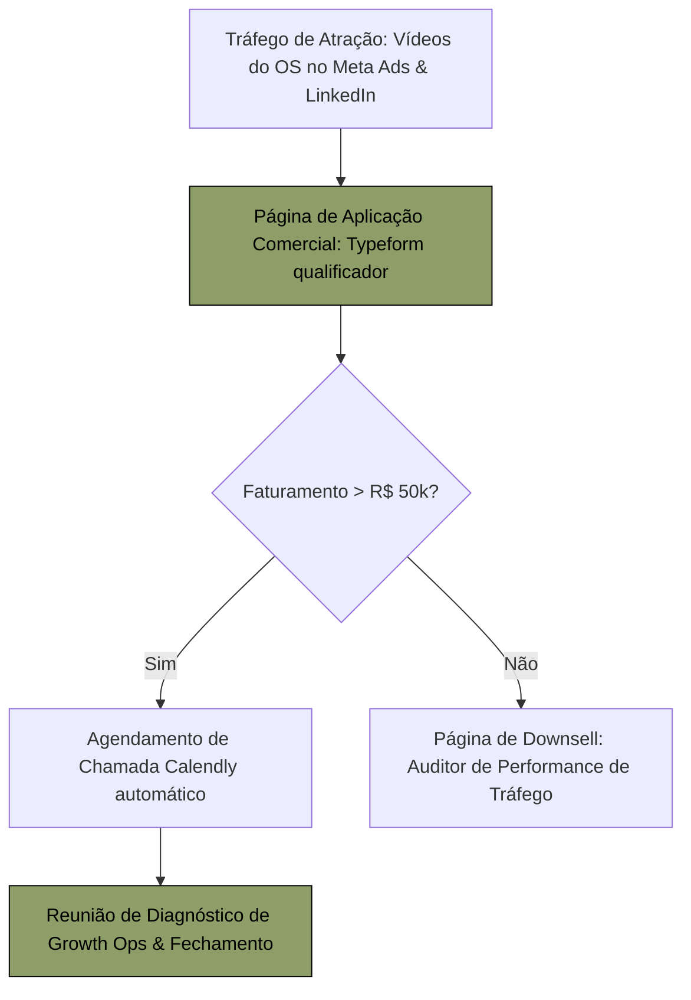

# PLANO PRIORITÁRIO DE RETOMADA COMERCIAL — FLUXAI LABS™
## ESTRATÉGIA HIGH-TICKET, ATRAÇÃO DE DEMANDA QUALIFICADA E ATIVOS OPERACIONAIS

**Fase Operacional:** FASE 06.4 (Plano Comercial de Retomada)  
**Versão:** 1.0.0 (Maio/2026)  
**Foco:** Contratos recorrentes corporativos (R$ 5.000,00 a R$ 15.000,00/mês)  
**Ativo Diferenciador:** **FluxAI OS™** (Infraestrutura central de comando de BI e automação)  
**Status do Núcleo do Sistema:** **CODE FREEZE ABSOLUTO INVIOLADO**  

---

## 1. Posicionamento Estratégico High-Ticket

Para se diferenciar em um mercado saturado de agências de marketing digital genéricas (commodities), a FluxAI Labs™ reposiciona-se estritamente como um **Laboratório de Engenharia e Operações de Crescimento (Growth Operations / Growth Ops) chancelado por Inteligência Artificial proprietária**.

Abandonamos definitivamente a linguagem e a imagem corporativa de "agência de posts e redes sociais". Nosso foco comercial é a **eficiência de processos, clareza síncrona de dados de tráfego, estruturação de CRM corporativo e automações cognitivas customizadas**.

### Os Três Pilares da Identidade Premium:
1.  **Diferenciação por Infraestrutura Proprietária:** Nós não apenas prestamos serviços; nós integramos o cliente a uma plataforma exclusiva de comando de crescimento (**FluxAI OS™**), garantindo transparência síncrona absoluta.
2.  **Linguagem C-Level Executiva:** Nossas discussões comerciais giram em torno de métricas de negócios (CAC, LTV, ROI, Margem de Contribuição e eficiência de canais), e não de vaidade (curtidas, comentários).
3.  **Hibridismo de IA e Engenharia Humana:** Nosso time atua na arquitetura estratégica e curadoria de dados, potencializado por automações Make que eliminam erros manuais e garantem velocidade instantânea de entrega.

---

## 2. A Nova Grade de Ofertas High-Ticket (GIaaS)

Apresentamos o modelo de contratação **Growth Infrastructure as a Service (GIaaS)**, estruturado em três pacotes recorrentes focados em valor percebido:

```text
[GIaaS ENTRY] ─────────────► [GIaaS SCALE] ─────────────► [GIaaS ENTERPRISE]
R$ 5.000 / mês              R$ 8.500 / mês              R$ 15.000 / mês
Growth Ops Básica +         Growth Ops Completa +       Escopo customizado +
Acesso OS +                 AI Credits Scale +          SLA Premium de IA +
AI Credits Entry            Suporte Direto C-Level      Consultoria de Dados
```

### 2.1. Plano GIaaS — ENTRY (R$ 5.000,00/mês)
*   **Foco:** PMEs consolidadas estruturando a primeira infraestrutura de growth.
*   **Escopo de Serviços:**
    *   *Growth Operations:* Gestão e otimização de campanhas de tráfego (Meta Ads + Instagram) e sincronização diária quantitativa.
    *   *FluxAI OS™:* 1 licença de acesso administrativo ao *Command Center* e *Flux Calendar* para acompanhamento de relatórios em tempo real.
    *   *IA Infrastructure:* Limite básico de **`50` créditos de IA** mensais para automação de legendas e rascunhos de pautas.

### 2.2. Plano GIaaS — SCALE (R$ 8.500,00/mês) — [RECOMENDADO]
*   **Foco:** Empresas em escala de faturamento buscando BI e automação profunda de vendas.
*   **Escopo de Serviços:**
    *   *Growth Operations:* Gestão avançada de canais (Meta Ads + Google Ads + GA4 BI completo), integração de funis de CRM e não-duplicação de leads.
    *   *FluxAI OS™:* 3 licenças administrativas personalizadas, com monitor de logs operacionais e relatórios mensais sob curadoria humana.
    *   *IA Infrastructure:* Limite avançado de **`150` créditos de IA** mensais para automações de landing pages, geração de pautas estratégicas e suporte de copys de alta conversão.

### 2.3. Plano GIaaS — ENTERPRISE (R$ 15.000,00/mês)
*   **Foco:** Corporações de grande porte exigindo arquitetura customizada de dados e infraestrutura.
*   **Escopo de Serviços:**
    *   *Growth Operations:* SLA dedicado de engenharia de dados, consultoria síncrona sênior com os sócios, BI integrado a múltiplos bancos do Sheets/Supabase.
    *   *FluxAI OS™:* Licenças ilimitadas para equipes de vendas internas e painéis analíticos de concorrência.
    *   *IA Infrastructure:* Limite customizado superior a **`300` créditos de IA** mensais, com desenvolvimento de prompts exclusivos para a marca e integrações dedicadas.

---

## 3. Funil de Atração de Demanda High-Ticket

A captação ativa de novos clientes corporativos de alto valor será orquestrada em 3 etapas de atração qualificadora:



1.  **Etapa 1 — Anúncios Criativos de Infraestrutura Proprietária:**  
    Rodar anúncios de tráfego qualificado no LinkedIn e Meta Ads. Os criativos devem ser vídeos dinâmicos em alta definição mostrando telas do **FluxAI OS™** operando na prática, com chamadas como: *"Chega de relatórios de vaidade em PDFs frios no final do mês. Veja como os clientes da FluxAI Labs acompanham métricas de tráfego e processos de IA em tempo real em nossa plataforma proprietária"*.
2.  **Etapa 2 — Formulário de Qualificação Estruturado (Typeform/OS):**  
    O prospect é direcionado a uma página de aplicação comercial onde responde a perguntas sobre:
    *   Faturamento mensal (filtro de corte de qualificação).
    *   Verba disponível mensal de Meta/Google Ads.
    *   Principais gargalos de time (lentidão, dados dispersos, falta de ROI).
3.  **Etapa 3 — Agendamento de Reunião Direto (Calendly síncrono):**  
    Leads altamente qualificados (faturamento superior a R$ 50k/mês e verba de anúncios > R$ 5k/mês) são redirecionados automaticamente ao Calendly dos sócios para agendar a Reunião de Diagnóstico. Leads que não passarem pelo filtro de corte são direcionados a uma oferta de entrada (Downsell de dados).

---

## 4. O Fluxo de Venda Consultiva e Onboarding Premium

O processo de fechamento comercial é focado em provar a maturidade operacional da marca na primeira reunião:

### 4.1. A Reunião de Diagnóstico de Growth (Fechamento)
1.  **Mapeamento de Gaps:** Os primeiros 15 minutos são focados em interrogar o prospect sobre seus gargalos de tráfego e a falta de visibilidade financeira.
2.  **Demonstração ao Vivo do OS (A Arma Secreta):** Compartilhar a tela e mostrar a interface do FluxAI OS™ operando em tempo real (Command Center, Flux Calendar). Isso demonstra autoridade tecnológica instantânea e destrói o posicionamento de agência comum.
3.  **Apresentação da Proposta GIaaS:** Apresentar a grade de ofertas ancorando os valores na economia de processos e inteligência centralizada inclusa no plano.

### 4.2. Onboarding Premium (As primeiras 48 Horas)
1.  **Assinatura Digital de Contrato:** O cliente assina o contrato e a automação registra a ativação na planilha matriz.
2.  **Entrega da Chave de Acesso:** O cliente recebe seu e-mail de acesso personalizado ao FluxAI OS™.
3.  **Wizard Operacional e Upload:** O cliente realiza o login, assiste ao vídeo curto de boas-vindas dos sócios e preenche os dados de conexão de marca, fornecendo as referências de pastas do Google Drive de forma elegante. A operação assistida da Fase 06 assume a decolagem.

---

## 5. Metas Comerciais e Cronograma de Retomada (Go-Live)

Mapeamento de metas e fases de execução tática comercial para a retomada:

*   **Fase A — Ativos Comerciais (Semana 1):** Conclusão e refatoração de todos os slides de propostas, gravação profissional de screencast do OS e setup dos Typeforms de aplicação de alta conversão.
*   **Fase B — Captação Ativa (Semana 2 a 4):** Lançamento de anúncios de atração premium no LinkedIn/Meta Ads e prospecção ativa de leads de alto valor chancelados pelo OS.
*   **Fase C — Aquisição (Meta Comercial):** Fechamento de **3 novos contratos recorrentes corporativos** na grade *GIaaS SCALE* (Faturamento adicional recorrente de R$ 25.500,00/mês).

---

*Plano tático prioritário comercial chancelado pela Banca de Governança de Elite da FluxAI Labs.*
