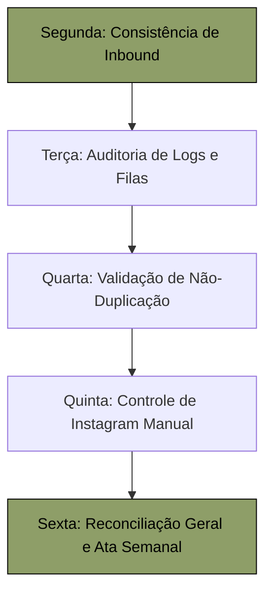

# ROTINA OPERACIONAL ASSISTIDA DA PRIMEIRA SEMANA — FASE 06.2
## DIRETRIZES DE EXECUÇÃO, ACOMPANHAMENTO E PAPÉIS DE GOVERNANÇA

**Fase Operacional:** FASE 06.2 (Rotina Operacional Assistida)  
**Versão:** 1.0.0 (Maio/2026)  
**Status do Repositório:** **CODE FREEZE ABSOLUTO ATIVO (100% INTACTO)**  
**Status de Schedules Make.com:** **CENÁRIOS CRÍTICOS EM MODO SEGURO (Active = OFF)**  

---

## 1. Introdução e Objetivos da Operação Assistida

A **Fase 06.2** inaugura o período de **operação assistida ativa** da FluxAI Labs. O objetivo central é estabelecer o acompanhamento rigoroso do ecossistema integrado **FluxAI OS™ + Make.com** ao longo de sua primeira semana produtiva sob governança de estado. 

Esse processo garante que as transações síncronas de baixo risco permaneçam estáveis, enquanto os cenários críticos e supervisionados são mantidos desativados em produção, sendo operados sob estrita curadoria técnica humana via acionamento manual unitário (*Run Once*).

---

## 2. Equipe de Governança e Responsáveis por Verificação

Para assegurar o cumprimento de todas as salvaguardas e diretrizes sem desvios de processo, dividem-se os papéis e responsabilidades operacionais da seguinte forma:

*   **ADMIN Estratégico (Diretoria):**
    *   *Função:* Aprovação final de relatórios mensais estratégicos e liberação manual de status de visibilidade para o portal (`enviado_cliente`). Autorização formal de faturamento de serviços extras e auditoria orçamentária geral.
*   **Analista Operacional (Suporte & Atendimento):**
    *   *Função:* Execução diária de checklists operacionais, monitoramento de filas do Make, alimentação de métricas semanais de contas manuais do Instagram, abertura de chamados técnicos e registro das Atas Diárias.
*   **Líder Técnico de Governança (Banca Técnica):**
    *   *Função:* Auditoria técnica quinzenal e semanal, execução do Checklist Semanal de Governança, reconciliação matemática de créditos de IA, varredura contra segredos e blueprints expostos, e controle de conformidade do *Code Freeze*.

---

## 3. Plano de Acompanhamento Assistido (Primeira Semana)

A rotina diária da primeira semana de operação assistida seguirá o seguinte plano de foco técnico:



*   **Segunda-feira (Foco em Inbound):** Monitorar a recepção de demandas de clientes no portal. Garantir que os cenários `03` e `04` processem as entradas de forma limpa.
*   **Terça-feira (Foco em Logs e Filas):** Auditoria profunda na fila de webhooks em `/os/logs.html`. Investigar e tratar erros de concorrência ou rate limiting de APIs do Sheets.
*   **Quarta-feira (Foco em Não-Duplicação):** Varredura analítica de dados contra duplicidades em cadastros de leads do site, chamados de suporte e orçamentos avulsos.
*   **Quinta-feira (Foco em Instagram Manual):** Execução do fluxo de alimentação de métricas de contas sem API ativa na aba `INSTAGRAM_DIARIO`.
*   **Sexta-feira (Foco em Reconciliação Geral):** Fechamento matemático de créditos de IA e aprovação das Atas Diárias e Checklist Semanal da Banca.

---

## 4. Diretrizes de Validação dos Cenários

O operador deve validar e manter estritamente os seguintes status de schedules:

1.  **Cenários Operacionais de Baixo Risco (Active = ON):**  
    Os cenários `01`, `02`, `03`, `04`, `05` e `06` devem ser monitorados para garantir execuções diárias contínuas automáticas. Em caso de queda de comunicação de APIs externas, o operador deve re-executar manualmente as filas afetadas.
2.  **Cenários Críticos e Supervisionados (Active = OFF):**  
    Os cenários `07`, `10`, `11`, `12`, `13` e `17` **não podem sob hipótese alguma ser ativados de forma automática em produção**. Toda e qualquer transação deve rodar em sandbox ou modo *Run Once* unitário após preenchimento e conferência.

---

## 5. Auditoria de Não-Duplicação de Dados

Para manter o banco de dados operacional Sheets leve e livre de redundâncias, o operador deve executar semanalmente a auditoria de chaves primárias e duplicados nas seguintes abas:

*   **Aba `LEADS_SITE`:**  
    *   *Verificação:* Ordenar por ordem cronológica e certificar que não existam linhas consecutivas contendo o mesmo e-mail, timestamp e telefone na mesma competência.
    *   *Ação Corretiva:* Caso detectado, manter apenas o registro mais antigo e excluir a linha duplicada, arquivando o ID no log de conformidade.
*   **Aba `DEMANDAS_CLIENTES`:**  
    *   *Verificação:* Certificar que cada demanda tenha um ID de transação exclusivo (`dem_xxxxxxxxx`).
    *   *Ação Corretiva:* Se houver ID duplicado decorrente de re-tentativa de webhook por delay, realizar a unificação de histórico e expurgar a linha sobressalente.
*   **Aba `SERVICOS_EXTRAS_CLIENTES`:**  
    *   *Verificação:* Validar se há mais de um registro do mesmo serviço avulso solicitado para o mesmo `client_id` no mesmo ciclo, sem justificativa contratual.
    *   *Ação Corretiva:* Sinalizar à diretoria antes de processar qualquer orçamento para impedir duplicidade de faturamento comercial.

---

## 6. Auditoria de Relatórios Mensais

Durante a semana ativa, o operador deve assegurar que a aba `RELATORIO_OPERACIONAL_FLUXAI` não receba alterações automáticas ou modificações públicas:
*   Os novos registros devem permanecer estritamente sob status **`rascunho_fluxai`**.
*   É expressamente proibido transicionar qualquer linha para `liberado_cliente` ou `enviado_cliente` de forma automática.
*   Qualquer relatório exposto sem o cumprimento do passo a passo do Protocolo de Curadoria Humana constituirá desvio gravíssimo de segurança.

---

## 7. Modelo de Ata Diária de Operação (Operador)

Abaixo está o modelo padrão que o analista de growth deve preencher ao final de cada dia de operação para consolidar o monitoramento:

```markdown
# ATA DIÁRIA DE OPERAÇÃO — FLUXAI OS™ & MAKE
**Data:** [DD/MM/AAAA]  
**Operador de Turno:** [Nome do Analista]  
**Responsável Técnico:** [Nome do Líder de Governança]  

### 1. Status de Schedules Make.com
* Cenários de Baixo Risco (01 a 06): [ ] CONFORME (Active = ON) | [ ] DESVIO: ___________
* Cenários Críticos (07 a 17): [ ] CONFORME (Active = OFF) | [ ] DESVIO: ___________

### 2. Monitoramento de Logs (/os/logs.html)
* Ocorrências de `WEBHOOK_REAL_FAILED`: [ ] Zero | [ ] Detalhes: __________________
* Ocorrências de `SECURITY_WARNING`: [ ] Zero | [ ] Detalhes: __________________

### 3. Consistência de Abas Sheets
* Duplicados em leads, chamados ou extras: [ ] Não Detectados | [ ] Ocorrências: ____
* Status de novos relatórios mensais: [ ] Todos como 'rascunho_fluxai' | [ ] Outros: ____

### 4. Incidentes e Ações Corretivas
* Descreva quaisquer falhas técnicas de API externa, rate limit ou intervenções manuais:
  __________________________________________________________________________________

**Chancela Digital do Operador:** _______________________________
```

---

*Diretrizes e protocolos de operação assistida chancelados para a equipe FluxAI Labs.*
