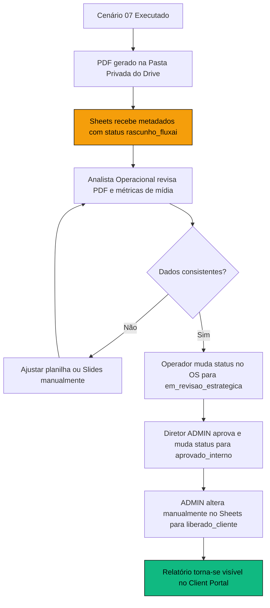

# MANUAL OPERACIONAL DE INTEGRAÇÕES — MAKE & FLUXAI OS™
## PROTOCOLOS DE GOVERNANÇA, CONTINGÊNCIA E CURADORIA ESTRATÉGICA

**Fase Operacional:** FASE 06 (Governança Operacional)  
**Versão:** 1.0.0 (Maio/2026)  
**Status do Core do OS:** **CODE FREEZE ATIVO**  
**Escopo:** Operações internas, controle de falhas e curadoria de limites.  

---

## 1. Visão Geral e Relação Síncrona OS <-> Make.com

A operação da FluxAI Labs baseia-se em um modelo híbrido onde o **FluxAI OS™** (sistema de interface, autenticação e gerenciamento de estado) comunica-se síncronamente via API e Webhooks com o motor de execução **Make.com**.

Essa relação síncrona exige monitoramento constante, pois flutuações nas APIs externas (Google Sheets, GDrive, Meta, Instagram, GA4) podem gerar falhas sistêmicas. Por design, o sistema opera sob a **Postura Fail-Safe**, bloqueando preventivamente chamadas ou débitos de saldo quando a comunicação é interrompida ou retorna códigos de erro.

---

## 2. Rotinas Operacionais da Equipe

A equipe de Operação e Suporte Técnico da FluxAI deve seguir uma rotina estritamente cronometrada para evitar gargalos e inconsistências na inteligência comercial:

### 2.1. Rotina Diária
*   **Auditoria de Logs de Transição (09:00 e 17:00):** Acessar a tela `/os/logs.html` e analisar os registros de transações síncronas. Investigar qualquer evento classificado como `WEBHOOK_REAL_FAILED` ou `SECURITY_WARNING`.
*   **Conferência de Alertas Financeiros:** Verificar se há inconsistência entre os créditos concedidos de IA e os serviços extras faturados no painel de controle administrativo.
*   **Monitoramento de Rate Limits:** Analisar no painel do Make.com se houve estouro de quota ou requisições bloqueadas de Google Sheets API devido à concorrência.

### 2.2. Rotina Semanal
*   **Consistência de Saldos (Toda Sexta-feira às 16:00):** Executar auditoria cruzada manual comparando o saldo registrado em `IA_CREDITOS_CLIENTE` na planilha matriz e as transações de debito na aba `IA_GERACOES_CONTROLE`. O saldo na aba de créditos deve equivaler exatamente a:
    $$\text{Saldo Inicial} + \text{Créditos Adquiridos} - \text{Créditos Consumidos}$$
*   **Carga Manual de Instagram (Clientes Sem Token):** Mapear clientes na base cuja integração do Instagram esteja sob status `ausente` ou `expirado` (ver Seção 8 deste manual).

### 2.3. Rotina Mensal (Fechamento)
*   **Competência e Compilação (1º dia útil de cada mês às 08:00):** Acompanhar a execução do cenário `07_FLUXAI_RELATORIO_MENSAL`. Certificar que os rascunhos de PDF foram gravados no GDrive privado e que as linhas na aba `RELATORIO_OPERACIONAL_FLUXAI` foram inseridas com status `rascunho_fluxai`.
*   **Auditoria e Curadoria Humana:** Revisar os PDFs gerados antes de liberar a visualização no portal do cliente (ver Seção 4).

---

## 3. Protocolos de Falha, Monitoramento e Rollback

Caso um webhook crítico do Make (ex: `REPORT_STATUS_UPDATE` ou `SERVICE_EXTRA_INTERNAL`) falhe ou atinja timeout de resposta, o sistema adota as seguintes diretrizes operacionais de contenção:

### 3.1. Detecção de Falha Síncrona
*   O FluxAI OS™ detectará timeout (`> 10s`) ou resposta técnica de erro (ex: `HTTP 500`, `HTTP 502`, ou o Fail-Safe `HTTP 410`).
*   O sistema exibirá alerta visual na tela administrativa: *"Falha Crítica de Conexão com o Webhook de Integração: Operação abortada e revertida com sucesso"*.

### 3.2. Procedimento de Rollback Sistêmico (Automático)
1.  **Bloqueio de Escrita Local:** A persistência em `localStorage` ou banco local é imediatamente suspensa.
2.  **Registro de Logs de Segurança:** O middleware dispara automaticamente os logs de governança:
    *   `WEBHOOK_REAL_FAILED`: Registra o endpoint inativo e a latência.
    *   `GOVERNANCE_ABORTED`: Cancela a transação comercial com justificativa de quebra de barramento.
    *   `ROLLBACK_STARTED` e `ROLLBACK_COMPLETED`: Garante que o status anterior da planilha permaneça intacto.

### 3.3. Ações Manuais do Operador (Após Alerta de Falha)
1.  Acessar o painel do Make.com e verificar se o cenário correspondente está **ON** ou travado com erro em fila.
2.  Se houver erro técnico de API externa (ex: erro de quota do Sheets), **não forçar reenvios automáticos**.
3.  Corrigir a planilha de dados na célula afetada e, somente após certificar estabilidade, solicitar ao administrador a re-execução pontual do lote em modo *Run Once*.

---

## 4. Protocolo de Aprovação de Relatório Mensal (Curadoria Híbrida)

A geração do relatório mensal segue o rigoroso protocolo de isolamento preventivo. Nenhum relatório é enviado de forma direta ou automática ao portal do cliente final:

### Passo a Passo Operacional:
1.  **Geração e Alocação:** O cenário 07 persiste o PDF do relatório na pasta restrita do cliente no GDrive (`07_METRICAS_E_RELATORIOS`) e grava os metadados com o status **`rascunho_fluxai`**. O relatório permanece 100% oculto no painel do cliente.
2.  **Curadoria Técnica (Analista):** O analista acessa a pasta do Drive, revisa as anotações do relatório e valida se as métricas numéricas extraídas de GA4 e Meta Ads conferem com as fontes.
3.  **Transição de Revisão:** O analista acessa `/os/relatorio-mensal.html`, clica no botão "Mudar para: Em Revisão Estratégica" (`em_revisao_estrategica`), iniciando o diagnóstico qualitativo humano.
4.  **Aprovação Interna (Diretoria):** O diretor ADMIN revisa e transiciona para "Aprovado Interno" (`aprovado_interno`).
5.  **Exposição Pública no Portal:** Somente após aprovação final e consenso estratégico, o operador acessa manualmente o Google Sheets e altera a coluna de status correspondente na aba `RELATORIO_OPERACIONAL_FLUXAI` para **`enviado_cliente`**. A partir desse exato instante, o relatório torna-se visível e renderizável no Client Portal do usuário.

---

## 5. Protocolo de Aprovação de Serviço Extra e Faturamento

Para evitar lançamentos indevidos de faturamento, a equipe deve seguir a regra de idempotência estrita:

1.  **Registro Inbound:** Quando o cliente solicita um serviço avulso no portal, a automação grava a demanda na aba `SERVICOS_EXTRAS_CLIENTES` sob status inicial **`solicitado`**.
2.  **Precificação (Orçamento):** O operador avalia a demanda técnica e transiciona para **`em_orcamento`** e, posteriormente, envia a cotação mudando o status para **`orcamento_enviado`**.
3.  **Aprovação e Idempotência:**
    *   A aprovação comercial síncrona do serviço só avança se o status de origem for estritamente elegível.
    *   Ao transicionar para **`aprovado`**, a automação do Make executa a verificação lógica de segurança: se a ID da transação já possui um registro de aprovação na auditoria financeira, o fluxo aborta instantaneamente com Custom Response `400 Bad Request` para impedir duplicidade de cobranças ou liberação em massa de créditos de IA.

---

## 6. Protocolo de Liberação e Estorno de Crédito IA

O saldo operacional de créditos de Inteligência Artificial é auditável e controlado:

### 6.1. Liberação de Créditos de IA (Serviço Extra Aprovado)
*   A liberação de saldo ocorre de forma restrita e síncrona no Cenário 12 quando um serviço extra que contém a flag `impacto_gpt = true` é transicionado para o status `aprovado`.
*   O operador deve certificar que a coluna `creditos_extras` na aba `SERVICOS_EXTRAS_CLIENTES` contenha exatamente o número inteiro aprovado contratualmente (ex: `10`, `25`, `50`).
*   O saldo do cliente em `IA_CREDITOS_CLIENTE` será incrementado e um log de conformidade será persistido na tabela `IA_GERACOES_CONTROLE` sob a ação `IA_CREDIT_RELEASED`.

### 6.2. Estorno Manual de Créditos de IA (Erro ou Descarte)
Caso ocorra uma falha técnica de geração GPT com consumo de cota sem entrega adequada ao cliente, o estorno deve ser executado da seguinte forma:
1.  **Proibição de Edição Direta:** É terminantemente proibido reescrever o número de saldo de créditos diretamente na planilha na aba do cliente.
2.  **Fluxo de Log de Estorno:** O operador deve cadastrar uma nova linha na aba `IA_GERACOES_CONTROLE` preenchendo:
    *   `client_id` e `generation_id` correspondentes.
    *   `status`: `descartado` ou `excluido`.
    *   `consumo_creditos`: Valor negativo correspondente ao estorno (ex: `-1`).
    *   `operador`: E-mail do administrador responsável.
3.  A automação síncrona de controle recalculará o saldo ativo do cliente de forma consistente e segura, registrando o estorno.

---

## 7. Protocolo Especial para Clientes com Instagram Manual

Clientes da agência que operam em canais de marca cuja API do Instagram não possui integração de token oficial ativa (status `ausente` ou `expirado`) devem seguir a rotina de carga consolidada humana:

### 7.1. Carga de Dados de Performance (Semanal - Segundas às 10:00)
1.  O analista de growth acessa manualmente a conta do Instagram profissional do cliente via aplicativo/navegador e exporta as métricas de alcance, engajamento e novos seguidores dos últimos 7 dias.
2.  Acessar a aba `INSTAGRAM_DIARIO` na planilha matriz e inserir a linha com o ID do cliente correspondente (ex: `FLUXAI_LABS_001`), preenchendo as colunas de métricas manuais.
3.  **Atenção:** A coluna `fonte_dados` deve ser preenchida obrigatoriamente como **`manual_curadoria`** para fins de auditoria de integridade.

### 7.2. Carga de Conteúdos da Mesa Editorial
Para que as postagens e cronograma apareçam no painel `flux-calendar.html` sem integração de API:
1.  O arte-finalista anexa o rascunho de arte e legenda na aba `MESA_EDITORIAL` preenchendo a coluna `integracao_api` como `false`.
2.  As artes devem ter o status inicial marcado como `content_approved` apenas sob aprovação explícita do cliente, liberando o analista de postagem para efetuar a publicação física no celular/desktop e atualizar manualmente o status no OS para `posted`.

---

## 8. Checklist de Prevenção de Erros e Checklist Operacional

Antes de autorizar qualquer religamento manual de cenários ou auditoria periódica, utilize a checklist abaixo:

*   [ ] **Planilha Livre de Travas:** Verificar se a planilha matriz não está bloqueada para edição ou com filtros ativos que impeçam o Make de localizar as chaves primárias.
*   [ ] **Zero Tokens Expostos:** Confirmar que nenhum token ou chave bruta foi colada em células públicas.
*   [ ] **Confirmação de Cota:** Validar se o saldo do cliente antes da execução do relatório está positivo.
*   [ ] **Isolamento de Webhooks:** Certificar que as URLs de webhook em Blueprints no repositório de teste estão mascaradas com `[REDIGIDO]`.
*   [ ] **Code Freeze Ativo:** Certificar que nenhum arquivo da pasta `/os` sofreu commits ou alterações não autorizadas pela governança.

---

*Manual de Operações e Governança aprovado e homologado para a equipe FluxAI Labs.*
