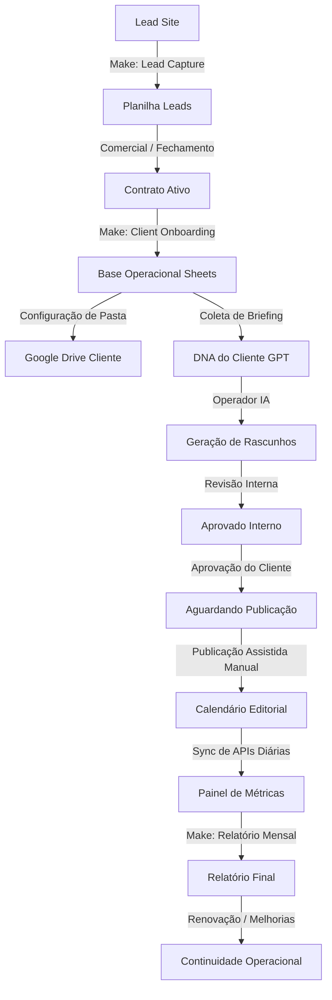

# MAPA DE FLUXOS OPERACIONAIS — FluxAI OS™
## Mapeamento Integrado Ponta a Ponta do Sistema de Crescimento

---

## 1. Visão Geral dos Fluxos
O ecossistema **FluxAI OS™** unifica a operação comercial, gestão contratual, produção inteligente de conteúdo e distribuição de relatórios. Este mapa descreve o percurso da informação e as ações necessárias de ponta a ponta.

---

## 2. Descrição Detalhada das Etapas do Fluxo

### Passo 1: Captação de Lead (`LEAD_CAPTURE`)
*   **Gatilho:** O visitante preenche o formulário no site institucional da FluxAI.
*   **Ação de Integração:** O site envia o payload via webhook `LEAD_CAPTURE` para o Make.com.
*   **Persistência:** O Make.com insere o lead na aba `LEADS_SITE` do Google Sheets.
*   **OS Interface:** O lead aparece na tela de Leads (`leads.html`) do Executive Center para acompanhamento do ADMIN.

### Passo 2: Negociação e Contrato (`CONTRACT_SIGNING`)
*   **Gatilho:** O lead progride no CRM de "Novo" para "Convertido".
*   **Ação do ADMIN:** O contrato de prestação de serviços é gerado e assinado eletronicamente.
*   **Google Drive:** O PDF do contrato assinado é salvo na pasta oficial de contratos no Drive.
*   **OS Interface:** O ADMIN cadastra o contrato no Executive Center, vinculando-o ao cliente.

### Passo 3: Ativação de Cliente (`CLIENT_ONBOARDING`)
*   **Gatilho:** O ADMIN clica em "Iniciar Onboarding" no cockpit do cliente.
*   **Ação de Integração:** O OS dispara o webhook `CLIENT_ONBOARDING` para o Make.com.
*   **Estruturação:** O Make.com cria a pasta padrão do cliente no Google Drive e preenche as abas `CLIENTES_CONFIG`, `SERVICOS_CLIENTES` e `CONTRATOS_CLIENTES`.
*   **Status de Transição:** O cliente passa a constar com status `onboarding`.

### Passo 4: Coleta de DNA (`DNA_SETUP`)
*   **Gatilho:** O operador envia o formulário de Kickoff para o cliente.
*   **Ação:** Os dados do público-alvo, objetivos comerciais, diferenciais e tom de voz são preenchidos.
*   **Persistência:** As informações de tom e estilo são salvas na aba `DNA_CLIENTE_GPT`.
*   **Uso:** Estes dados servirão de contexto essencial (guardrails e contexto) para o motor de IA.

### Passo 5: Geração de Conteúdo com IA (`AI_GENERATION`)
*   **Gatilho:** O operador abre o motor de conteúdo (`content-engine.html`) e clica em "Gerar Ideia" ou "Gerar Texto".
*   **Ação:** O OS solicita a criação ao modelo GPT integrado, fornecendo as variáveis salvas na aba `DNA_CLIENTE_GPT`.
*   **Logs:** A geração registra um log com o prompt utilizado na aba de logs de auditoria.
*   **Status do Conteúdo:** O post é gravado como `rascunho_ia` (não consome cota do limite contratado).

### Passo 6: Planejamento e Revisão Interna (`INTERNAL_REVIEW`)
*   **Gatilho:** O operador de conteúdo revisa o rascunho.
*   **Ação:** Ajusta o texto, atribui o caminho da imagem no Drive ou link do Canva.
*   **Transição de Status:** Ao concluir, move o post para `aprovado_interno`. A cota de entregas do cliente é pré-reservada no sistema.

### Passo 7: Validação pelo Cliente (`CLIENT_APPROVAL`)
*   **Gatilho:** O cliente acessa o Portal do Cliente (`client-portal.html`).
*   **Ação:** O cliente analisa as peças na aba "Entregas Pendentes" e clica em **Aprovar** ou **Reprovar** (enviando feedback de refação).
*   **Persistência:** Se aprovado, o post é marcado como `aguardando_publicacao`. Se reprovado, volta para `em_revisao` para ajuste pelo operador.

### Passo 8: Publicação Assistida Manual (`MANUAL_PUBLISHING`)
*   **Gatilho:** O post atinge a data programada para publicação.
*   **Ação:** O operador abre a tela de Publicação Assistida no OS. Copia a legenda para a área de transferência, acessa a pasta no Drive para baixar a mídia e publica manualmente no Instagram.
*   **Confirmação:** Após publicar no Instagram, clica em **Confirmar Publicação Manual** no OS.
*   **Consumo Definitivo:** O sistema altera o status do post para `publicado` e atualiza permanentemente o limite operacional consumido na aba `IA_CREDITOS_CLIENTE`.

### Passo 9: Sincronização de Métricas (`DAILY_METRICS_SYNC`)
*   **Gatilho:** Cron job diário agendado no Make.com (ex: às 02:00h).
*   **Ação:** O Make.com consulta as APIs da Meta (Instagram/Ads) e Google (GA4/Search Console).
*   **Persistência:** Grava os dados históricos de performance nas abas correspondentes (`GA4_DIARIO`, `INSTAGRAM_DIARIO`, etc.).
*   **Visualização:** O painel de métricas no OS consome esses dados para atualizar o dashboard do cliente e da agência.

### Passo 10: Relatório Mensal de Performance (`MONTHLY_REPORT`)
*   **Gatilho:** Final de ciclo mensal do contrato.
*   **Ação:** O operador compila os dados e insere a análise qualitativa no OS (`relatorio-mensal.html`).
*   **Aprovação Executiva:** O ADMIN aprova o relatório, disparando o webhook de liberação.
*   **Entrega:** O cliente visualiza o relatório consolidado direto no seu portal e recebe uma via PDF em sua pasta de relatórios no Google Drive.

### Passo 11: Continuidade Operacional (`OPERATIONAL_CONTINUITY`)
*   **Gatilho:** Renovação contratual ou início do novo mês de faturamento.
*   **Ação:** O faturamento recorrente é processado (financeiro), os limites operacionais de IA são reiniciados para o novo mês na aba `IA_CREDITOS_CLIENTE` e o fluxo recomeça no planejamento.
